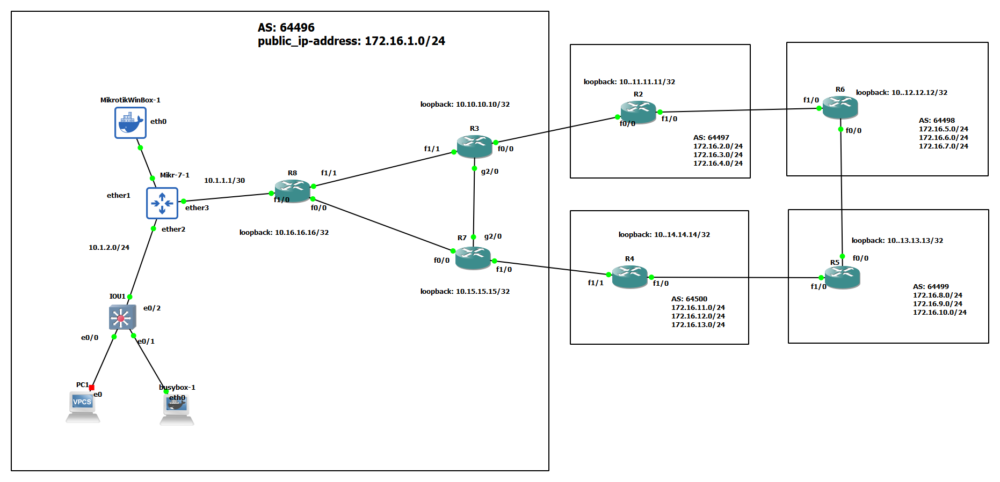

# BGP 




# Mikrotik

```
/ip addres
add address=10.1.1.2/30 interface=ether3 network=10.1.1.0
add address=10.1.2.1/24 interface=ether2 network=10.1.2.0


/ip route/add dst-address=0.0.0.0/0 gateway=10.1.1.1


/ip firewall address-list
add address=10.1.2.0/24 list=LAN


/ip pool
add name=NAT-Pool ranges=172.16.1.0/24


/ip firewall nat
add action=src-nat chain=srcnat out-interface=ether3 src-address-list=LAN to-addresses=172.16.1.0/24


```

# R3

```
int fa 0/0
no sh
ip addr 10.10.23.3 255.255.255.0


int fa 1/1
no sh
ip addr 10.10.38.3 255.255.255.0


int gig 2/0
no sh
ip addr 10.10.37.3 255.255.255.0


int loopback 0
no sh
ip addr 10.10.10.10 255.255.255.255


ip route 10.11.11.11 255.255.255.255 10.10.23.2


router ospf 1
router-id 3.3.3.3
network 10.10.37.3 0.0.0.0 area 0
network 10.10.38.3 0.0.0.0 area 0
network 10.10.10.10 0.0.0.0 area 0


router bgp 64496
neighbor 10.11.11.11 remote-as 64497
neighbor 10.11.11.11 update-source loopback 0
neighbor 10.11.11.11 ebgp-multihop 5

neighbor 10.15.15.15 remote-as 64496
neighbor 10.15.15.15 update-source loopback 0
neighbor 10.15.15.15 next-hop-self


neighbor 10.16.16.16 remote-as 64496
neighbor 10.16.16.16 update-source loopback 0
neighbor 10.16.16.16 next-hop-self


! we can advertise network with redistribute
! ip prefix-list adv-route permit 172.16.1.0/24
! route-map adv-routemap permit 10
! match ip address prefix-list adv-route

router bgp 64496
address-family ipv4 unicast
redistribute static route-map adv-routemap


do sh bgp ipv4 unicast summary
sh ip bgp nei | inc BGP neighbor is |  BGP state = 

alias exec custom-command sh ip bgp nei | inc BGP neighbor is |  BGP state =
do custom-command
```

# R7

```
int fa 1/0
no sh
ip addr 10.10.47.7 255.255.255.0


int gig 2/0
no sh
ip addr 10.10.37.7 255.255.255.0


int fa 0/0
no sh
ip addr 10.10.78.7 255.255.255.0

int loopback 0
ip addr 10.15.15.15 255.255.255.255

ip route 10.14.14.14 255.255.255.255 10.10.47.4


router ospf 1
router-id 7.7.7.7
network 10.10.37.7 0.0.0.0 area 0
network 10.10.78.7 0.0.0.0 area 0
network 10.15.15.15 0.0.0.0 area 0


router bgp 64496
neighbor 10.14.14.14 remote-as 64500
neighbor 10.14.14.14 update-source loopback 0
neighbor 10.14.14.14 ebgp-multihop 5

neighbor 10.10.10.10 remote-as 64496
neighbor 10.10.10.10 update-source loopback 0
neighbor 10.10.10.10 next-hop-self


neighbor 10.16.16.16 remote-as 64496
neighbor 10.16.16.16 update-source loopback 0
neighbor 16.16.16.16 next-hop-self

```


# R8

```
int fa 1/1
no sh
ip addr 10.10.38.8 255.255.255.0


int fa 0/0
no sh
ip addr 10.10.78.8 255.255.255.0


int fa 1/0
no sh
ip addr 10.1.1.1 255.255.255.252


int loopback 0 
ip addr 10.16.16.16 255.255.255.255


ip route 172.16.1.0 255.255.255.0 10.1.1.2


router ospf 1
router-id 8.8.8.8
network 10.10.38.8 0.0.0.0 area 0
network 10.10.78.8 0.0.0.0 area 0
network 10.16.16.16 0.0.0.0 area 0


router bgp 64496
neighbor 10.15.15.15 remote-as 64496
neighbor 10.15.15.15 update-source loopback 0


neighbor 10.10.10.10 remote-as 64496
neighbor 10.10.10.10 update-source loopback 0

address-family ipv4 unicast
network 172.16.1.0 mask 255.255.255.0


```


# R2

```
int fa 0/0
no sh
ip addr 10.10.23.2 255.255.255.0


int fa 1/0
no sh
ip addr 10.10.26.2 255.255.255.0

int loopback 0 
ip addr 10.11.11.11 255.255.255.255

ip route 10.10.10.10 255.255.255.255 10.10.23.3
ip route 10.12.12.12 255.255.255.255 10.10.26.6


int loopback 2
ip addr 172.16.2.1 255.255.255.0

int loopback 3
ip addr 172.16.3.1 255.255.255.0

int loopback 4
ip addr 172.16.4.1 255.255.255.0


router bgp 64497
neighbor 10.10.10.10 remote-as 64496
neighbor 10.10.10.10 update-source loopback 0
neighbor 10.10.10.10 ebgp-multihop 5

neighbor 10.12.12.12 remote-as 64498
neighbor 10.12.12.12 update-source loopback 0
neighbor 10.12.12.12 ebgp-multihop 5


address-family ipv4 unicast
network 172.16.2.0 mask 255.255.255.0
network 172.16.3.0 mask 255.255.255.0
network 172.16.4.0 mask 255.255.255.0


```


# R6

```
int fa 0/0
no sh
ip addr 10.10.56.6 255.255.255.0


int fa 1/0
no sh
ip addr 10.10.26.6 255.255.255.0

int loopback 0 
ip addr 10.12.12.12 255.255.255.255

ip route 10.11.11.11 255.255.255.255 10.10.26.2
ip route 10.13.13.13 255.255.255.255 10.10.56.5


router bgp 64498
neighbor 10.11.11.11 remote-as 64497
neighbor 10.11.11.11 update-source loopback 0
neighbor 10.11.11.11 ebgp-multihop 5

neighbor 10.13.13.13 remote-as 64499
neighbor 10.13.13.13 update-source loopback 0
neighbor 10.13.13.13 ebgp-multihop 5


```

# R5

```
int fa 0/0
no sh
ip addr 10.10.56.5 255.255.255.0


int fa 1/0
no sh
ip addr 10.10.45.5 255.255.255.0

int loopback 0 
ip addr 10.13.13.13 255.255.255.255

ip route 10.14.14.14 255.255.255.255 10.10.45.4
ip route 10.12.12.12 255.255.255.255 10.10.56.6

router bgp 64499
neighbor 10.12.12.12 remote-as 64498
neighbor 10.12.12.12 update-source loopback 0
neighbor 10.12.12.12 ebgp-multihop 5

neighbor 10.14.14.14 remote-as 64500
neighbor 10.14.14.14 update-source loopback 0
neighbor 10.14.14.14 ebgp-multihop 5


```


# R4

```
int fa 1/1
no sh
ip addr 10.10.47.4 255.255.255.0


int fa 1/0
no sh
ip addr 10.10.45.4 255.255.255.0

int loopback 0 
ip addr 10.14.14.14 255.255.255.255

ip route 10.13.13.13 255.255.255.255 10.10.45.5
ip route 10.15.15.15 255.255.255.255 10.10.47.7


router bgp 64500
neighbor 10.15.15.15 remote-as 64496
neighbor 10.15.15.15 update-source loopback 0
neighbor 10.15.15.15 ebgp-multihop 5

neighbor 10.13.13.13 remote-as 64499
neighbor 10.13.13.13 update-source loopback 0
neighbor 10.13.13.13 ebgp-multihop 5


do sh bgp ipv4 unicast summary
sh ip bgp nei | inc BGP neighbor is |  BGP state =

```