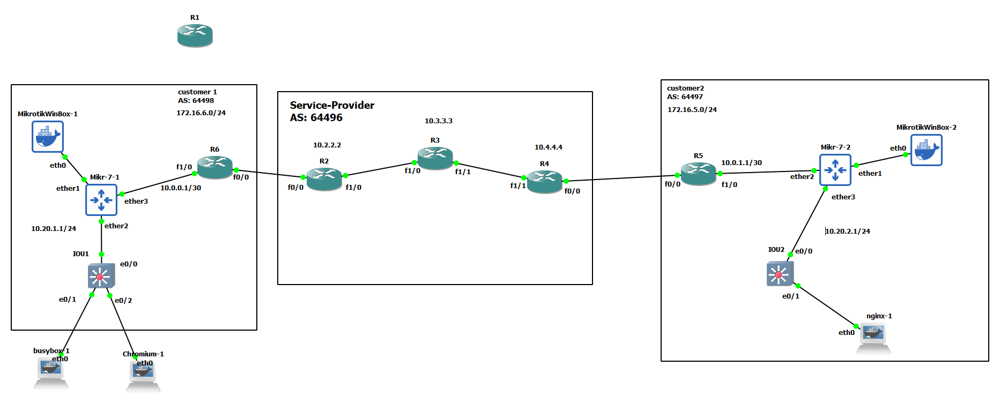

# BGP



# R6

```
int fa 0/0
no sh
ip addr 10.10.26.6 255.255.255.0


int fa 1/0
no sh
ip addr 10.0.0.1 255.255.255.252


ip route 172.16.6.0 255.255.255.0 10.0.0.2


router bgp 64498
neighbor 10.10.26.2 remote-as 64496
address-family ipv4 unicast
network 172.16.6.0 mask 255.255.255.0


```


# R2

```

int fa 0/0
no sh
ip addr 10.10.26.2 255.255.255.0


int fa 1/0
no sh
ip addr 10.10.23.2 255.255.255.0


int loopback 0
ip addr 10.2.2.2 255.255.255.255


router ospf 1
router-id 2.2.2.2
network 10.10.23.2 0.0.0.0 area 0
network 10.2.2.2 0.0.0.0 area 0


router bgp 64496
neighbor 10.10.26.6 remote-as 64498
neighbor 10.4.4.4 remote-as 64496
neighbor 10.4.4.4 update-source loopback 0
neighbor 10.4.4.4 next-hop-self

neighbor 10.3.3.3 remote-as 64496
neighbor 10.3.3.3 update-source loopback 0
neighbor 10.3.3.3 next-hop-self

```


# R3

```

int fa 1/0
no sh
ip addr 10.10.23.3 255.255.255.0

int fa 1/1
no sh
ip addr 10.10.34.3 255.255.255.0

int loopback 0
ip addr 10.3.3.3 255.255.255.255


router ospf 1
router-id 3.3.3.3
network 10.10.23.3 0.0.0.0 area 0
network 10.10.34.3 0.0.0.0 area 0
network 10.3.3.3 0.0.0.0 area 0


router bgp 64496
neighbor 10.2.2.2 remote-as 64496
neighbor 10.2.2.2 update-source loopback 0

neighbor 10.4.4.4 remote-as 64496
neighbor 10.4.4.4 update-source loopback 0


```

# R4

```
int fa 0/0
no sh
ip addr 10.10.45.4 255.255.255.0

int fa 1/1
no sh
ip addr 10.10.34.4 255.255.255.0


int loopback 0
ip addr 10.4.4.4 255.255.255.255

router ospf 1
router-id 4.4.4.4
network 10.10.34.4 0.0.0.0 area 0
network 10.4.4.4 0.0.0.0 area 0


router bgp 64496
neighbor 10.10.45.5 remote-as 64497
neighbor 10.2.2.2 remote-as 64496
neighbor 10.2.2.2 update-source loopback 0
neighbor 10.2.2.2 next-hop-self

neighbor 10.3.3.3 remote-as 64496
neighbor 10.3.3.3 update-source loopback 0
neighbor 10.3.3.3 next-hop-self


```


# R5

```

int fa 0/0
no sh
ip addr 10.10.45.5 255.255.255.0


int fa 1/0
no sh
ip addr 10.0.1.1 255.255.255.252


ip route 172.16.5.0 255.255.255.0 10.0.1.2


router bgp 64497
neighbor 10.10.45.4 remote-as 64496
address-family ipv4 unicast
network 172.16.5.0 mask 255.255.255.0
```


# Mikrotik(customer1)
```
/ip address
add address=10.0.0.2/30 interface=ether3 network=10.0.0.0
add address=10.20.1.1/24 interface=ether2 network=10.20.1.0


/ip firewall address-list
add address=10.20.1.0/24 list=NAT-Only


/ip firewall nat
add action=src-nat chain=srcnat out-interface=ether3 \
    src-address-list=NAT-Only to-addresses=172.16.6.1-172.16.6.20


/ip route
add disabled=no dst-address=0.0.0.0/0 gateway=10.0.0.1 routing-table=\
    main suppress-hw-offload=no


```


# Mikrotik(customer2)
```
/ip address
add address=10.0.1.2/30 interface=ether2 network=10.0.0.0
add address=10.20.2.1/24 interface=ether3 network=10.20.1.0


/ip route
add disabled=no dst-address=0.0.0.0/0 gateway=10.0.1.1 routing-table=\
    main suppress-hw-offload=no


/ip firewall nat
add action=dst-nat chain=dstnat dst-address=172.16.5.1 in-interface=\
    ether2 to-addresses=10.20.2.10


/interface bridge
add name=loopback0


/ip address
add address=172.16.5.2/24 interface=loopback0 network=172.16.5.0


```