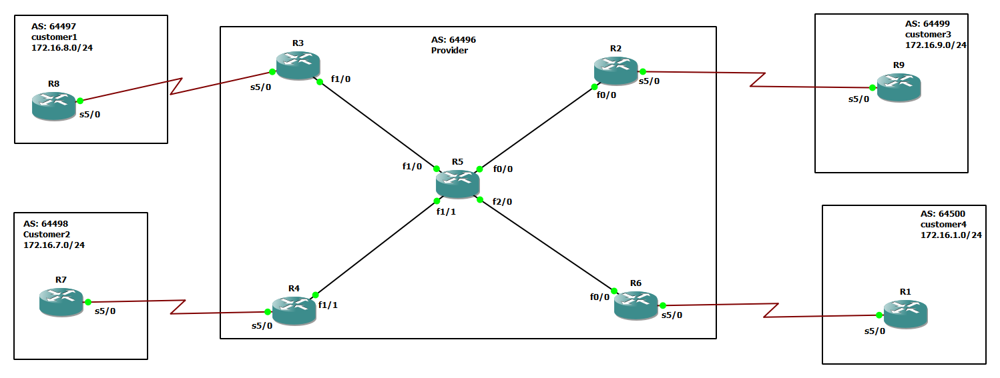

# iBGP-Mesh-Peer Group



# R5

```
int fa 0/0
no sh
ip addr 10.10.25.5 255.255.255.0


int fa 1/0
no sh
ip addr 10.10.35.5 255.255.255.0


int fa 1/1
no sh
ip addr 10.10.45.5 255.255.255.0


int fa 2/0
no sh
ip addr 10.10.56.5 255.255.255.0

int loopback 0
ip addr 10.5.5.5 255.255.255.255

router ospf 1
router-id 5.5.5.5
network 10.5.5.5 0.0.0.0 area 0
network 10.10.56.5 0.0.0.0 area 0
network 10.10.45.5 0.0.0.0 area 0
network 10.10.35.5 0.0.0.0 area 0
network 10.10.25.5 0.0.0.0 area 0


router bgp 64496
neighbor 10.2.2.2 remote-as 64496
neighbor 10.2.2.2 update-source loopback 0

neighbor 10.3.3.3 remote-as 64496
neighbor 10.3.3.3 update-source loopback 0

neighbor 10.4.4.4 remote-as 64496
neighbor 10.4.4.4 update-source loopback 0

neighbor 10.6.6.6 remote-as 64496
neighbor 10.6.6.6 update-source loopback 0


```


# R3

```
int fa 1/0
no sh
ip addr 10.10.35.3 255.255.255.0

int seri 5/0
no sh
ip addr 10.10.38.3 255.255.255.0


int loopback 0
ip addr 10.3.3.3 255.255.255.255


router ospf 1
router-id 3.3.3.3
network 10.3.3.3 0.0.0.0 area 0
network 10.10.35.3 0.0.0.0 area 0


router bgp 64496
neighbor 10.10.38.8 remote-as 64497


neighbor 10.2.2.2 remote-as 64496
neighbor 10.2.2.2 update-source loopback 0
neighbor 10.2.2.2 next-hop-self


neighbor 10.5.5.5 remote-as 64496
neighbor 10.5.5.5 update-source loopback 0
neighbor 10.5.5.5 next-hop-self

neighbor 10.4.4.4 remote-as 64496
neighbor 10.4.4.4 update-source loopback 0
neighbor 10.4.4.4 next-hop-self

neighbor 10.6.6.6 remote-as 64496
neighbor 10.6.6.6 update-source loopback 0
neighbor 10.6.6.6 next-hop-self


```


# R4

```

int fa 1/1
no sh
ip addr 10.10.45.4 255.255.255.0


int seri 5/0
no sh
ip addr 10.10.47.4 255.255.255.0


int loopback 0
ip addr 10.4.4.4 255.255.255.255


router ospf 1
router-id 4.4.4.4
network 10.4.4.4 0.0.0.0 area 0
network 10.10.45.4 0.0.0.0 area 0


router bgp 64496
neighbor 10.10.47.7 remote-as 64498

neighbor 10.2.2.2 remote-as 64496
neighbor 10.2.2.2 update-source loopback 0
neighbor 10.2.2.2 next-hop-self

neighbor 10.5.5.5 remote-as 64496
neighbor 10.5.5.5 update-source loopback 0
neighbor 10.5.5.5 next-hop-self

neighbor 10.3.3.3 remote-as 64496
neighbor 10.3.3.3 update-source loopback 0
neighbor 10.3.3.3 next-hop-self

neighbor 10.6.6.6 remote-as 64496
neighbor 10.6.6.6 update-source loopback 0
neighbor 10.6.6.6 next-hop-self
```

# R2

```
int fa 0/0
no sh
ip addr 10.10.25.2 255.255.255.0

int serial 5/0
no sh
ip addr 10.10.29.2 255.255.255.0


int loopback 0
ip addr 10.2.2.2 255.255.255.255

router ospf 1
router-id 2.2.2.2
network 10.2.2.2 0.0.0.0 area 0
network 10.10.25.2 0.0.0.0 area 0


router bgp 64496
neighbor 10.10.29.9 remote-as 64499

neighbor template peer-group 
neighbor template remote-as 64496
neighbor template update-source loopback 0
neighbor template next-hop-self


neighbor 10.4.4.4 peer-group template 
neighbor 10.5.5.5 peer-group template 
neighbor 10.3.3.3 peer-group template 
neighbor 10.6.6.6 peer-group template 


```


# R6

```

int fa 0/0
no sh
ip addr 10.10.56.6 255.255.255.0

int serial 5/0
no sh
ip addr 10.10.16.6 255.255.255.0

int loopback 0
ip addr 10.6.6.6 255.255.255.255

router ospf 1
router-id 6.6.6.6
network 10.6.6.6 0.0.0.0 area 0
network 10.10.56.6 0.0.0.0 area 0


router bgp 64496
neighbor 10.10.16.1 remote-as 64500

neighbor template peer-group 
neighbor template remote-as 64496
neighbor template update-source loopback 0
neighbor template next-hop-self


neighbor 10.4.4.4 peer-group template 
neighbor 10.5.5.5 peer-group template 
neighbor 10.3.3.3 peer-group template 
neighbor 10.2.2.2 peer-group template 


```


# R1

```

int serial 5/0
no sh
ip addr 10.10.16.1 255.255.255.0

int loopback 0 
ip addr 172.16.1.1 255.255.255.0


router bgp 64500 
neighbor 10.10.16.6 remote-as 64496
address-family ipv4 unicast 
network 172.16.1.0 mask 255.255.255.0


```


# R9
```
int serial 5/0
no sh
ip addr 10.10.29.9 255.255.255.0


int loopback 0 
ip addr 172.16.9.1 255.255.255.0

router bgp 64499
neighbor 10.10.29.2 remote-as 64496
address-family ipv4 unicast 
network 172.16.9.0 mask 255.255.255.0
```

# R8

```
int serial 5/0
no sh
ip addr 10.10.38.8 255.255.255.0


int loopback 0 
ip addr 172.16.8.1 255.255.255.0


router bgp 64497
neighbor 10.10.38.3 remote-as 64496
address-family ipv4 unicast 
network 172.16.8.0 mask 255.255.255.0

```


# R7

```
int serial 5/0
no sh
ip addr 10.10.47.7 255.255.255.0

int loopback 0 
ip addr 172.16.7.1 255.255.255.0


router bgp 64498
neighbor 10.10.47.4 remote-as 64496
address-family ipv4 unicast 
network 172.16.7.0 mask 255.255.255.0

```

