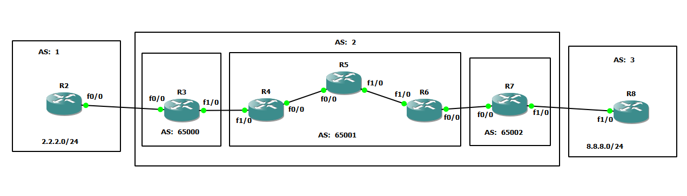

# iBGP confederation




# R1

```
int fa 0/0
no sh
ip addr 10.10.23.2 255.255.255.0


int loopback 0
no sh
ip addr 2.2.2.1 255.255.255.0


router bgp 1
neighbor 10.10.23.3 remote-as 2
address-family ipv4 unicast
network 2.2.2.0 mask 255.255.255.0


```


# R3

```
int fa 0/0
no sh
ip addr 10.10.23.3 255.255.255.0

int fa 1/0
no sh
ip addr 10.10.34.3 255.255.255.0

int loopback 0
ip addr 10.3.3.3 255.255.255.255


router ospf 1
router-id 3.3.3.3
network 10.3.3.3 0.0.0.0 area 0
network 10.10.34.3 0.0.0.0 area 0


router bgp 65000
bgp confederation identifier 2
bgp confederation peers 65001 65002
neighbor 10.10.23.2 remote-as 1

neighbor 10.4.4.4 remote-as 65001
neighbor 10.4.4.4 update-source loopback 0
neighbor 10.4.4.4 ebgp-multihop 2
neighbor 10.4.4.4 next-hop-self


```

# R4

```
int fa 0/0
no sh
ip addr 10.10.45.4 255.255.255.0

int fa 1/0
no sh
ip addr 10.10.34.4 255.255.255.0

int loopback 0
ip addr 10.4.4.4 255.255.255.255


router ospf 1
router-id 4.4.4.4
network 10.4.4.4 0.0.0.0 area 0
network 10.10.34.4 0.0.0.0 area 0
network 10.10.45.4 0.0.0.0 area 0


router bgp 65001
bgp confederation identifier 2
bgp confederation peers 65000 65002

neighbor 10.3.3.3 remote-as 65000
neighbor 10.3.3.3 update-source loopback 0
neighbor 10.3.3.3 ebgp-multihop 2

neighbor 10.5.5.5 remote-as 65001
neighbor 10.5.5.5 update-source loopback 0

neighbor 10.6.6.6 remote-as 65001
neighbor 10.6.6.6 update-source loopback 0


```


# R5

```
int fa 0/0
no sh
ip addr 10.10.45.5 255.255.255.0

int fa 1/0
no sh
ip addr 10.10.56.5 255.255.255.0

int loopback 0
ip addr 10.5.5.5 255.255.255.255


router ospf 1
router-id 5.5.5.5
network 10.5.5.5 0.0.0.0 area 0
network 10.10.45.5 0.0.0.0 area 0
network 10.10.56.5 0.0.0.0 area 0


router bgp 65001
bgp confederation identifier 2
bgp confederation peers 65000 65002

neighbor 10.4.4.4 remote-as 65001
neighbor 10.4.4.4 update-source loopback 0


neighbor 10.6.6.6 remote-as 65001
neighbor 10.6.6.6 update-source loopback 0


```

# R6

```
int fa 0/0
no sh
ip addr 10.10.67.6 255.255.255.0

int fa 1/0
no sh
ip addr 10.10.56.6 255.255.255.0

int loopback 0
ip addr 10.6.6.6 255.255.255.255


router ospf 1
router-id 6.6.6.6
network 10.6.6.6 0.0.0.0 area 0
network 10.10.56.6 0.0.0.0 area 0
network 10.10.67.6 0.0.0.0 area 0


router bgp 65001
bgp confederation identifier 2
bgp confederation peers 65000 65002

neighbor 10.7.7.7 remote-as 65002
neighbor 10.7.7.7 update-source loopback 0
neighbor 10.7.7.7 ebgp-multihop 2

neighbor 10.5.5.5 remote-as 65001
neighbor 10.5.5.5 update-source loopback 0

neighbor 10.4.4.4 remote-as 65001
neighbor 10.4.4.4 update-source loopback 0


```


# R7

```
int fa 0/0
no sh
ip addr 10.10.67.7 255.255.255.0

int fa 1/0
no sh
ip addr 10.10.78.7 255.255.255.0

int loopback 0
ip addr 10.7.7.7 255.255.255.255


router ospf 1
router-id 7.7.7.7
network 10.7.7.7 0.0.0.0 area 0
network 10.10.67.7 0.0.0.0 area 0


router bgp 65002
bgp confederation identifier 2
bgp confederation peers 65001 65000

neighbor 10.10.78.8 remote-as 3
neighbor 10.10.78.8 ebgp-multihop 2

neighbor 10.6.6.6 remote-as 65001
neighbor 10.6.6.6 update-source loopback 0
neighbor 10.6.6.6 ebgp-multihop 2
neighbor 10.6.6.6 next-hop-self


```


# R8

```
int fa 1/0
no sh
ip addr 10.10.78.8 255.255.255.0


int loopback 0
no sh
ip addr 8.8.8.1 255.255.255.0


router bgp 3
neighbor 10.10.78.7 remote-as 2
address-family ipv4 unicast
network 8.8.8.0 mask 255.255.255.0


```