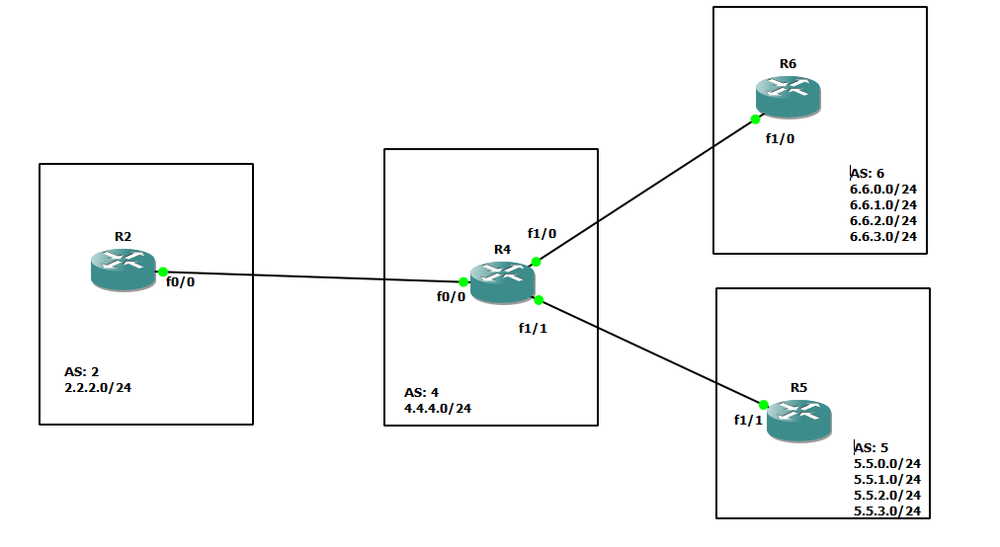

# BGP summerazation




# R2

```
int fa 0/0
no sh
ip addr 10.10.24.2 255.255.255.0


int loopback 0
ip addr 2.2.2.1 255.255.255.0


router bgp 2
neighbor 10.10.24.4 remote-as 4
neighbor 10.10.24.4 ebgp-multihop 5
address-family ipv4 unicast
network 2.2.2.0 mask 255.255.255.0


```


# R4

```
int fa 0/0
no sh
ip addr 10.10.24.4 255.255.255.0

int fa 1/1
no sh
ip addr 10.10.45.4 255.255.255.0


int fa 1/0
no sh
ip addr 10.10.46.4 255.255.255.0

int loopback 0
ip addr 4.4.4.1 255.255.255.0


router bgp 4
neighbor 10.10.24.2 remote-as 2
neighbor 10.10.24.2 ebgp-multihop 5

neighbor 10.10.45.5 remote-as 5
neighbor 10.10.45.5 ebgp-multihop 5

neighbor 10.10.46.6 remote-as 6
neighbor 10.10.46.6 ebgp-multihop 5


address-family ipv4 unicast
network 4.4.4.0 mask 255.255.255.0
!aggregate-address 6.6.0.0 255.255.252.0
!aggregate-address 5.5.0.0 255.255.252.0

aggregate-address 6.6.0.0 255.255.252.0 summary-only
aggregate-address 5.5.0.0 255.255.252.0 summary-onlys


```


# R6

```
int fa 1/0
no sh
ip addr 10.10.46.6 255.255.255.0


int loopback 0
ip addr 6.6.0.1 255.255.255.0

int loopback 1
ip addr 6.6.1.1 255.255.255.0

int loopback 2
ip addr 6.6.2.1 255.255.255.0

int loopback 3
ip addr 6.6.3.1 255.255.255.0

router bgp 6
neighbor 10.10.46.4 remote-as 4
neighbor 10.10.46.4 ebgp-multihop 5
address-family ipv4 unicast
network 6.6.0.0 mask 255.255.255.0
network 6.6.1.0 mask 255.255.255.0
network 6.6.2.0 mask 255.255.255.0
network 6.6.3.0 mask 255.255.255.0


```


# R5

```
int fa 1/1
no sh
ip addr 10.10.45.5 255.255.255.0


int loopback 0
ip addr 5.5.0.1 255.255.255.0

int loopback 1
ip addr 5.5.1.1 255.255.255.0

int loopback 2
ip addr 5.5.2.1 255.255.255.0

int loopback 3
ip addr 5.5.3.1 255.255.255.0


router bgp 5
neighbor 10.10.45.4 remote-as 4
neighbor 10.10.45.4 ebgp-multihop 5
address-family ipv4 unicast
network 5.5.0.0 mask 255.255.255.0
network 5.5.1.0 mask 255.255.255.0
network 5.5.2.0 mask 255.255.255.0
network 5.5.3.0 mask 255.255.255.0


```


