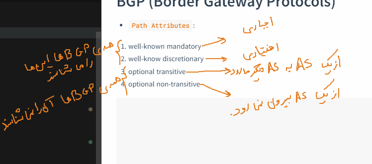

# BGP (Border Gateway Protocols)
* `Path Attributes`:
1. well-known mandatory ( AS-Path)
2. well-know discretionary
3. optional transitive
4. optional non-transitive



# Basic configuration

```
router bgp 100
 neighbor 10.10.0.0 remote-as 500
 neighbor 10.10.0.0 update-source loopback1 
 neighbor 10.10.0.0 ebgp-multihop 6


# monitoring
sh bgp ipv4 unicast neighbors | inc BGP neighbor is | BGP state =
alias exec mynei sh bgp ipv4 unicast neighbors | inc BGP neighbor is | BGP state =


# addvertise a route using network command
ip rotue 11.22.10.0 255.255.255.0 null 0

router bgp 100
 address-family ipv4 unicast
  network 11.22.10.0 mask 255.255.255.0


# addvertise a route with redistribute and route-map

ip prefix-list bgpadvertise seq 5 permit 11.22.10.0/24
route-map bgpad permit 10
 match ip address prefix-list bgpadvertise
 exit

rotuer bgp 100
 address-family ipv4 unicast
  redistribute static route-map bgpad


```


# RR (Route Reflector)


```


```