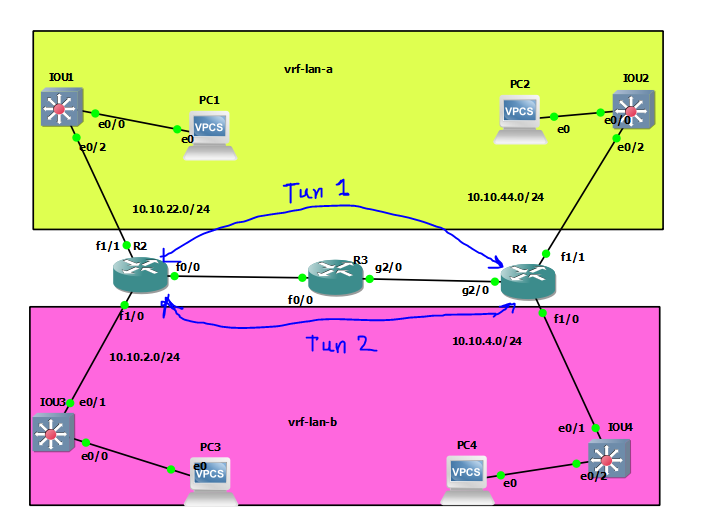

# GRE-VRF





# R2

```
ip vrf lan-a
exit

ip vrf lan-b
exit


interface fastEthernet 0/0
ip address 10.10.23.2 255.255.255.0
no sh


interface fastEthernet 1/0
ip vrf forwarding lan-b
ip address 10.10.2.1 255.255.255.0
no sh


interface fastEthernet 1/1
ip vrf forwarding lan-a
ip address 10.10.22.1 255.255.255.0
no sh


router eigrp 1
network 10.10.23.2  0.0.0.0


int tunnel 1
ip vrf forwarding lan-a
tunnel key 1
tunnel source 10.10.23.2 
tunnel destin 10.10.34.4 
ip addr 10.10.10.1 255.255.255.252
ip mtu 1400
ip tcp adjust-mss 1360

ip route vrf lan-a 10.10.44.0 255.255.255.0 10.10.10.2


int tunnel 2
ip vrf forwarding lan-b
tunnel key 2
tunnel source 10.10.23.2 
tunnel destin 10.10.34.4 
ip addr 192.168.87.1 255.255.255.252
ip mtu 1400
ip tcp adjust-mss 1360

ip route vrf lan-b 10.10.4.0 255.255.255.0 192.168.87.2


```


# R3

```

interface fastEthernet 0/0
ip address 10.10.23.3 255.255.255.0
no sh


interface gig 2/0
ip address 10.10.34.3 255.255.255.0
no sh


router eigrp 1
network 10.10.23.3 0.0.0.0
network 10.10.34.3 0.0.0.0


```


# R4

```
ip vrf lan-a
exit

ip vrf lan-b
exit


interface gig 2/0
ip address 10.10.34.4 255.255.255.0
no sh


interface fastEthernet 1/0
ip vrf forwarding lan-b
ip address 10.10.4.1 255.255.255.0
no sh


interface fastEthernet 1/1
ip vrf forwarding lan-a
ip address 10.10.44.1 255.255.255.0
no sh

router eigrp 1
network 10.10.34.4 0.0.0.0


int tunnel 1
ip vrf forwarding lan-a
tunnel key 1
tunnel source 10.10.34.4 
tunnel destin 10.10.23.2 
ip addr 10.10.10.2 255.255.255.252
ip mtu 1400
ip tcp adjust-mss 1360

ip route vrf lan-a 10.10.22.0 255.255.255.0 10.10.10.1


int tunnel 2
ip vrf forwarding lan-b
tunnel key 2
tunnel source 10.10.34.4 
tunnel destin 10.10.23.2 
ip addr 192.168.87.2 255.255.255.252
ip mtu 1400
ip tcp adjust-mss 1360

ip route vrf lan-b 10.10.2.0 255.255.255.0 192.168.87.1


```