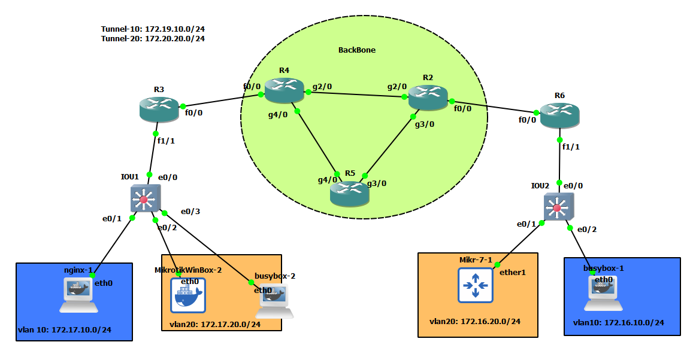

# GRE-VRF





## R2

```

int gig 2/0
no sh
ip add 10.10.24.2 255.255.255.0

int gig 3/0
no sh
ip addr 10.10.25.2 255.255.255.0


int fa 0/0
ip addr 10.10.26.2 255.255.255.0
no sh


router eigrp myeig
address-family ipv4 unicast as 1
network 10.10.25.2 0.0.0.0
network 10.10.24.2 0.0.0.0
network 10.10.26.2 0.0.0.0
af-interface fastEthernet 0/0
passive-interface


```


## R5

```

int gig 3/0
no sh
ip addr 10.10.25.5 255.255.255.0


int gig 4/0
no sh
ip addr 10.10.45.5 255.255.255.0


router eigrp myeig
address-family ipv4 unicast as 1
network 10.10.25.5 0.0.0.0
network 10.10.45.5 0.0.0.0


```

## R4

```

int gig 2/0
no sh
ip addr 10.10.24.4 255.255.255.0


int gig 4/0
no sh
ip addr 10.10.45.4 255.255.255.0


int fa 0/0
ip addr 10.10.34.4 255.255.255.0
no sh


router eigrp myeig
address-family ipv4 unicast as 1
network 10.10.24.4 0.0.0.0
network 10.10.45.4 0.0.0.0
network 10.10.34.4 0.0.0.0
af-interface fastEthernet 0/0
passive-interface


```


# R3

```

ip vrf lan-10
exit

ip vrf lan-20
exit


int fa 0/0
ip addr 10.10.34.3 255.255.255.0
no sh


int fa 1/1
no sh
exit

int fa 1/1.10
ip vrf forwarding lan-10
encapsulation dot1Q 10
ip addr 172.17.10.1 255.255.255.0


int fa 1/1.20
ip vrf forwarding lan-20
encapsulation dot1Q 20
ip addr 172.17.20.1 255.255.255.0


ip route 0.0.0.0 0.0.0.0 10.10.34.4


int tunnel 10
ip vrf forwarding lan-10
tunnel key 10
tunnel source 10.10.34.3
tunnel destin 10.10.26.6
ip addr 172.19.19.3 255.255.255.0
ip mtu 1400
ip tcp adjust-mss 1360


int tunnel 20
ip vrf forwarding lan-20
tunnel key 20
tunnel source 10.10.34.3
tunnel destin 10.10.26.6
ip addr 172.20.20.3 255.255.255.0
ip mtu 1400
ip tcp adjust-mss 1360


router eigrp my-eigrp-vrf
address-family ipv4 unicast vrf lan-10 autonomous-system 2
network 172.19.19.3 0.0.0.0
network 172.17.10.1 0.0.0.0

exit
address-family ipv4 unicast vrf lan-20 autonomous-system 2
network 172.20.20.3 0.0.0.0
network 172.17.20.1 0.0.0.0
exit


```

# IOU1

```
interface ethernet 0/0
switchport trunk encapsulation dot1q
switchport mode trunk

vlan 10,20


interface ethernet 0/1
switchport mode access
switchport access vlan 10


interface ethernet 0/2
switchport mode access
switchport access vlan 20


```


# R6

```
ip vrf lan-10
exit

ip vrf lan-20
exit


int fa 0/0
ip addr 10.10.26.6 255.255.255.0
no sh


int fa 1/1
no sh
exit

int fa 1/1.10
ip vrf forwarding lan-10
encapsulation dot1Q 10
ip addr 172.16.10.1 255.255.255.0


int fa 1/1.20
ip vrf forwarding lan-20
encapsulation dot1Q 20
ip addr 172.16.20.1 255.255.255.0


ip route 0.0.0.0 0.0.0.0 10.10.26.2


int tunnel 10
ip vrf forwarding lan-10
tunnel key 10
tunnel source 10.10.26.6
tunnel destin 10.10.34.3
ip addr 172.19.19.6 255.255.255.0
ip mtu 1400
ip tcp adjust-mss 1360


int tunnel 20
ip vrf forwarding lan-20
tunnel key 20
tunnel source 10.10.26.6
tunnel destin 10.10.34.3
ip addr 172.20.20.6 255.255.255.0
ip mtu 1400
ip tcp adjust-mss 1360


router eigrp my-eigrp-vrf
address-family ipv4 unicast vrf lan-10 autonomous-system 2
network 172.19.19.6 0.0.0.0
network 172.16.10.1 0.0.0.0

exit
address-family ipv4 unicast vrf lan-20 autonomous-system 2
network 172.20.20.6 0.0.0.0
network 172.16.20.1 0.0.0.0
exit


```

# IOU1

```
interface ethernet 0/0
switchport trunk encapsulation dot1q
switchport mode trunk

vlan 10,20


interface ethernet 0/1
switchport mode access
switchport access vlan 20


interface ethernet 0/2
switchport mode access
switchport access vlan 10


```


