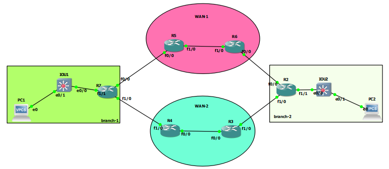

# FVRF




# R7

```

vrf definition wan-1
address-family ipv4
exit
exit


vrf definition wan-2
address-family ipv4
exit
exit

interface fastEthernet 0/0
vrf forwarding wan-1
no sh
ip address 10.10.57.7 255.255.255.0


interface fastEthernet 1/0
vrf forwarding wan-2
no sh
ip address 10.10.47.7 255.255.255.0

do sh vrf

int fa 1/1
no sh
ip addr 10.10.7.1 255.255.255.0


ip route vrf wan-1 0.0.0.0 0.0.0.0 10.10.57.5
ip route vrf wan-2 0.0.0.0 0.0.0.0 10.10.47.4


int tunnel 1
tunnel source 10.10.57.7
tunnel destin 10.10.26.2
ip addr 192.168.87.1 255.255.255.252
ip mtu 1400
ip tcp adjust-mss 1360
tunnel vrf wan-1


int tunnel 2
tunnel source 10.10.47.7
tunnel destin 10.10.23.2
ip addr 192.168.88.1 255.255.255.252
ip mtu 1400
ip tcp adjust-mss 1360
tunnel vrf wan-2


ip route 10.10.2.0 255.255.255.0 192.168.87.2
ip route 10.10.2.0 255.255.255.0 192.168.88.2


```

# R5

```
interface fastEthernet 0/0
no sh
ip address 10.10.57.5 255.255.255.0


interface fastEthernet 1/0
no sh
ip address 10.10.56.5 255.255.255.0


router eigrp 1
network 10.10.57.5 0.0.0.0
network 10.10.56.5 0.0.0.0


```


# R6
```
interface fastEthernet 0/0
no sh
ip address 10.10.26.6 255.255.255.0


interface fastEthernet 1/0
no sh
ip address 10.10.56.6 255.255.255.0


router eigrp 1
network 10.10.26.6 0.0.0.0
network 10.10.56.6 0.0.0.0


```


# R2

```
vrf definition wan-1
address-family ipv4
exit
exit


vrf definition wan-2
address-family ipv4
exit
exit

interface fastEthernet 0/0
vrf forwarding wan-1
no sh
ip address 10.10.26.2 255.255.255.0


interface fastEthernet 1/0
vrf forwarding wan-2
no sh
ip address 10.10.23.2 255.255.255.0


int fa 1/1
no sh
ip addr 10.10.2.1 255.255.255.0


ip route vrf wan-1 0.0.0.0 0.0.0.0 10.10.26.6
ip route vrf wan-2 0.0.0.0 0.0.0.0 10.10.23.3


int tunnel 1
tunnel destin 10.10.57.7
tunnel source 10.10.26.2
ip addr 192.168.87.2 255.255.255.252
ip mtu 1400
ip tcp adjust-mss 1360
tunnel vrf wan-1


int tunnel 2
tunnel destin 10.10.47.7
tunnel source 10.10.23.2
ip addr 192.168.88.2 255.255.255.252
ip mtu 1400
ip tcp adjust-mss 1360
tunnel vrf wan-2


ip route 10.10.7.0 255.255.255.0 192.168.87.1
ip route 10.10.7.0 255.255.255.0 192.168.88.1
```


# R3

```

interface fastEthernet 0/0
no sh
ip address 10.10.34.3 255.255.255.0


interface fastEthernet 1/0
no sh
ip address 10.10.23.3 255.255.255.0


router eigrp 2
network 10.10.34.3 0.0.0.0
network 10.10.23.3 0.0.0.0


```

# R4

```
interface fastEthernet 0/0
no sh
ip address 10.10.34.4 255.255.255.0


interface fastEthernet 1/0
no sh
ip address 10.10.47.4 255.255.255.0


router eigrp 2
network 10.10.34.4 0.0.0.0
network 10.10.47.4 0.0.0.0


```