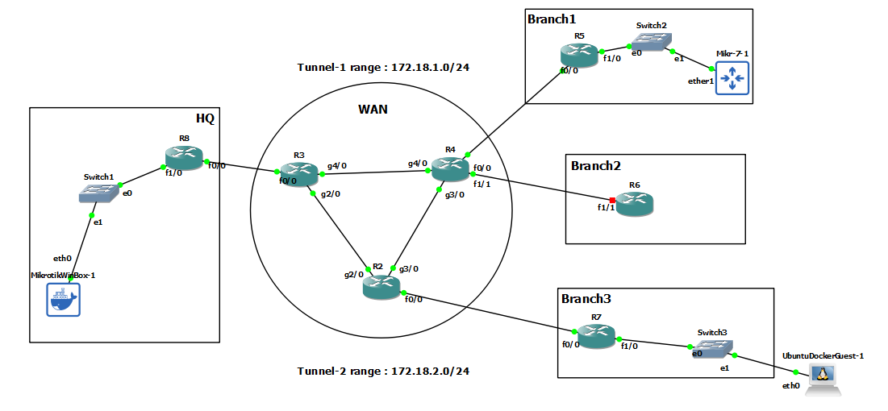

# GRE over Ipsec (IKE version1 + Crypto Map)



# R3

```

int fa 0/0
ip addr 10.10.38.3 255.255.255.0
no sh


int gig 2/0
no sh
ip addr 10.10.23.3 255.255.255.0

int gig 4/0
no sh
ip addr 10.10.34.3 255.255.255.0


router eigrp myeig
address-family ipv4 unicast as 1
network 10.10.34.3 0.0.0.0
network 10.10.23.3 0.0.0.0
network 10.10.38.3 0.0.0.0
af-interface fastEthernet 0/0
passive-interface


```


# R4

```

int fa 0/0
ip addr 10.10.45.4 255.255.255.0
no sh

int fa 1/1
ip addr 10.10.46.4 255.255.255.0
no sh


int gig 4/0
no sh
ip addr 10.10.34.4 255.255.255.0

int gig 3/0
no sh
ip addr 10.10.24.4 255.255.255.0


router eigrp myeig
address-family ipv4 unicast as 1
network 10.10.24.4 0.0.0.0
network 10.10.34.4 0.0.0.0
network 10.10.45.4 0.0.0.0
network 10.10.46.4 0.0.0.0 
af-interface fastEthernet 0/0
passive-interface
exit
af-interface fastEthernet 1/1
passive-interface
exit
exit


```


# R2

```

int fa 0/0
ip addr 10.10.27.2 255.255.255.0
no sh


int gig 2/0
no sh
ip addr 10.10.23.2 255.255.255.0

int gig 3/0
no sh
ip addr 10.10.24.2 255.255.255.0


router eigrp myeig
address-family ipv4 unicast as 1
network 10.10.24.2 0.0.0.0
network 10.10.23.2 0.0.0.0
network 10.10.27.2 0.0.0.0
af-interface fastEthernet 0/0
passive-interface


```


# R8-HQ

```
int fa 0/0
ip addr 10.10.38.8 255.255.255.0
no sh


int fa 1/0
no sh
ip addr 10.10.8.1  255.255.255.0


ip route 0.0.0.0 0.0.0.0 10.10.38.3


crypto isakmp policy 10
authentication pre-share
hash sha256
encryption aes 256
group 14
exit

crypto isakmp key password address 0.0.0.0

crypto ipsec transform-set T-SET esp-aes esp-sha-hmac
mode transport
exit


ip access-list extended Branch1-ipsec-acl
permit gre host 10.10.38.8 host 10.10.45.5
exit

ip access-list extended Branch2-ipsec-acl
permit gre host 10.10.38.8 host 10.10.27.7
exit


crypto map C-MAP 10 ipsec-isakmp
match address Branch1-ipsec-acl
set transform-set T-SET
set peer 10.10.45.5


crypto map C-MAP 20 ipsec-isakmp
match address Branch2-ipsec-acl
set transform-set T-SET
set peer 10.10.27.7

int fa 0/0
crypto map C-MAP


interface tunnel 1
ip address 172.18.1.8 255.255.255.0
tunnel source 10.10.38.8
tunnel destination 10.10.45.5


interface tunnel 2
ip address 172.18.2.8 255.255.255.0
tunnel source 10.10.38.8
tunnel destination 10.10.27.7


router ospf 1
router-id 8.8.8.8
network 172.18.1.8 0.0.0.0 area 0
network 10.10.8.1 0.0.0.0 area 0
network 172.18.2.8 0.0.0.0 area 0


```


# R5-Branch1

```

int fa 0/0
ip addr 10.10.45.5 255.255.255.0
no sh


int fa 1/0
no sh
ip addr 10.10.5.1  255.255.255.0


ip route 0.0.0.0 0.0.0.0 10.10.45.4

crypto isakmp policy 10
authentication pre-share
hash sha256
encryption aes 256
group 14
exit

crypto isakmp key password address 0.0.0.0

crypto ipsec transform-set T-SET esp-aes esp-sha-hmac
mode transport
exit


ip access-list extended HQ-ipsec-acl
permit gre host 10.10.45.5 host 10.10.38.8
exit


crypto map C-MAP 10 ipsec-isakmp
match address HQ-ipsec-acl
set transform-set T-SET
set peer  10.10.38.8

int fa 0/0
crypto map C-MAP


interface tunnel 1
ip address 172.18.1.5 255.255.255.0
tunnel source 10.10.45.5
tunnel destination 10.10.38.8


router ospf 1
router-id 5.5.5.5
network 172.18.1.5 0.0.0.0 area 0
network 10.10.5.1 0.0.0.0 area 0


```


# R7-Branch3

```

int fa 0/0
ip addr 10.10.27.7 255.255.255.0
no sh


int fa 1/0
no sh
ip addr 10.10.7.1  255.255.255.0


ip route 0.0.0.0 0.0.0.0 10.10.27.2


crypto isakmp policy 10
authentication pre-share
hash sha256
encryption aes 256
group 14
exit

crypto isakmp key password address 0.0.0.0

crypto ipsec transform-set T-SET esp-aes esp-sha-hmac
mode transport
exit


ip access-list extended HQ-ipsec-acl
permit gre host 10.10.27.7 host 10.10.38.8
exit

crypto map C-MAP 10 ipsec-isakmp
match address HQ-ipsec-acl
set transform-set T-SET
set peer 10.10.38.8


interface tunnel 1
ip address 172.18.2.7 255.255.255.0
tunnel source 10.10.27.7
tunnel destination 10.10.38.8


int fa 0/0
crypto map C-MAP


router ospf 1
router-id 7.7.7.7
network 172.18.2.7 0.0.0.0 area 0
network 10.10.7.1 0.0.0.0 area 0


```