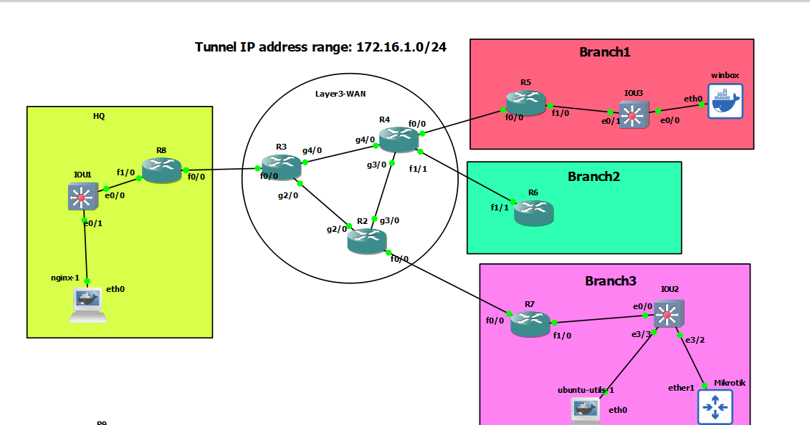

# DMVPN Phase 2


each spoke can talk to each other directly



# R3

```

int fa 0/0
ip addr 10.10.38.3 255.255.255.0
no sh


int gig 2/0
no sh
ip addr 10.10.23.3 255.255.255.0

int gig 4/0
no sh
ip addr 10.10.34.3 255.255.255.0


router eigrp myeig
address-family ipv4 unicast as 1
network 10.10.34.3 0.0.0.0
network 10.10.23.3 0.0.0.0
network 10.10.38.3 0.0.0.0
af-interface fastEthernet 0/0
passive-interface

```


# R2

```

int fa 0/0
ip addr 10.10.27.2 255.255.255.0
no sh


int gig 2/0
no sh
ip addr 10.10.23.2 255.255.255.0

int gig 3/0
no sh
ip addr 10.10.24.2 255.255.255.0


router eigrp myeig
address-family ipv4 unicast as 1
network 10.10.24.2 0.0.0.0
network 10.10.23.2 0.0.0.0
network 10.10.27.2 0.0.0.0
af-interface fastEthernet 0/0
passive-interface

```


# R4

```

int fa 0/0
ip addr 10.10.45.4 255.255.255.0
no sh

int fa 1/1
ip addr 10.10.46.4 255.255.255.0
no sh


int gig 4/0
no sh
ip addr 10.10.34.4 255.255.255.0

int gig 3/0
no sh
ip addr 10.10.24.4 255.255.255.0


router eigrp myeig
address-family ipv4 unicast as 1
network 10.10.24.4 0.0.0.0
network 10.10.34.4 0.0.0.0
network 10.10.45.4 0.0.0.0
network 10.10.46.4 0.0.0.0 
af-interface fastEthernet 0/0
passive-interface
exit
af-interface fastEthernet 1/1
passive-interface
exit
exit

```

# R8-HQ

```

int fa 0/0
ip addr 10.10.38.8 255.255.255.0
no sh

ip route 0.0.0.0 0.0.0.0 10.10.38.3


int tun 1
ip address 172.16.1.8 255.255.255.0
ip nhrp authentication secret
ip nhrp network-id 1
ip nhrp map multicast dynamic
tunnel source 10.10.38.8
tunnel mode gre multipoint
ip mtu 1400
ip tcp adjust-mss 1360


int fa 1/0
no sh
ip addr 10.10.8.1 255.255.255.0

ip route 10.10.5.0 255.255.255.0 172.16.1.5
ip route 10.10.6.0 255.255.255.0 172.16.1.6
ip route 10.10.7.0 255.255.255.0 172.16.1.7


do sh dmvpn

```


# R5-Spoke

```

int fa 0/0
ip addr 10.10.45.5 255.255.255.0
no sh

ip route 0.0.0.0 0.0.0.0 10.10.45.4


int tun 1
ip address 172.16.1.5 255.255.255.0
ip nhrp authentication secret
ip nhrp network-id 1
ip nhrp nhs 172.16.1.8
ip nhrp map 172.16.1.8 10.10.38.8
ip nhrp map multicast 10.10.38.8
tunnel source 10.10.45.5
tunnel mode gre multipoint
ip mtu 1400
ip tcp adjust-mss 1360


int fa 1/0
no sh
ip addr 10.10.5.1 255.255.255.0

ip route 10.10.7.0 255.255.255.0 172.16.1.8
ip route 10.10.6.0 255.255.255.0 172.16.1.8
ip route 10.10.8.0 255.255.255.0 172.16.1.8


do sh dmvpn

```


# R6-Spoke

```

int fa 1/1
ip addr 10.10.46.6 255.255.255.0
no sh

ip route 0.0.0.0 0.0.0.0 10.10.46.4


int tun 1
ip address 172.16.1.6 255.255.255.0
ip nhrp authentication secret
ip nhrp network-id 1
ip nhrp nhs 172.16.1.8
ip nhrp map 172.16.1.8 10.10.38.8
ip nhrp map multicast 10.10.38.8
tunnel source 10.10.46.6
tunnel mode gre multipoint
ip mtu 1400
ip tcp adjust-mss 1360


do sh dmvpn

```


# R7-Spoke

```

int fa 0/0
ip addr 10.10.27.7 255.255.255.0
no sh

ip route 0.0.0.0 0.0.0.0 10.10.27.2


int tun 1
ip address 172.16.1.7 255.255.255.0
ip nhrp authentication secret
ip nhrp network-id 1
ip nhrp nhs 172.16.1.8 nbma 10.10.38.8 multicast
tunnel source 10.10.27.7
tunnel mode gre multipoint
ip mtu 1400
ip tcp adjust-mss 1360


int fa 1/0
no sh
ip addr 10.10.7.1 255.255.255.0

ip route 10.10.5.0 255.255.255.0 172.16.1.8
ip route 10.10.6.0 255.255.255.0 172.16.1.8
ip route 10.10.8.0 255.255.255.0 172.16.1.8


do sh dmvpn


```