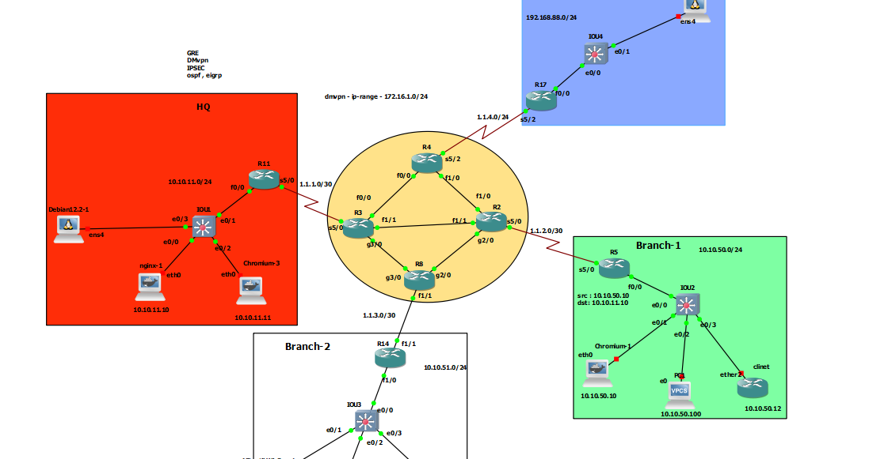

# DMVPN - Phase 2 - OSPF




## R11-HUB

```


int tun 0
ip address 172.16.1.11 255.255.255.0
ip nhrp authentication secret
ip nhrp network-id 1
ip nhrp map multicast dynamic
tunnel source 1.1.1.2
tunnel mode gre multipoint
ip mtu 1400
ip tcp adjust-mss 1360
ip ospf network broadcast 
ip ospf priority 255


router ospf 1
router-id 11.11.11.11
network 172.16.1.0 0.0.0.255 area 0
network 10.10.11.0 0.0.0.255 area 0


```


## R5-Spoke
```


int tun 0
ip address 172.16.1.5 255.255.255.0
ip nhrp authentication secret
ip nhrp network-id 1
ip nhrp nhs 172.16.1.11 nbma 1.1.1.2 multicast
tunnel source serial 5/0
tunnel mode gre multipoint
ip nhrp holdtime 600
ip nhrp registration no-unique
ip mtu 1400
ip tcp adjust-mss 1360
ip ospf network broadcast 
ip ospf priority 0


router ospf 1
router-id 11.11.11.11
network 172.16.1.0 0.0.0.255 area 0
network 10.10.11.0 0.0.0.255 area 0


```


# HUB
```

```


# SPOKE


```


router ospf 1
router-id 11.11.11.11
network 172.16.1.0 0.0.0.255 area 0
network 192.168.88.0 0.0.0.255 area 0


```
