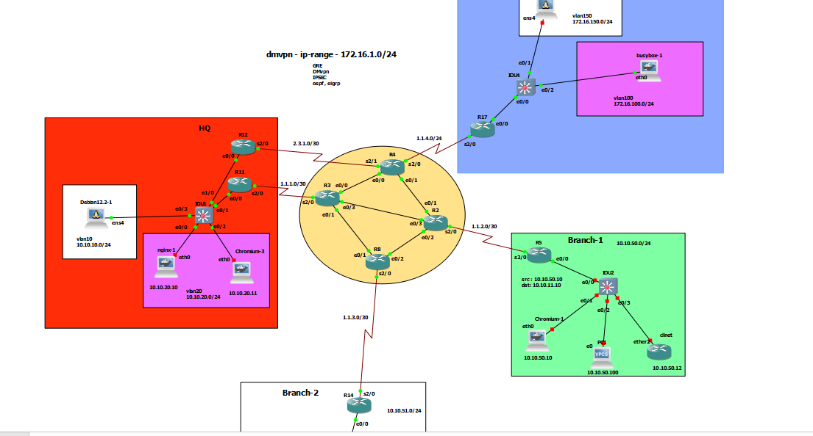

# DMVPN HA


# R11-HUB-1


```

interface ethernet 0/0.10
encapsulation dot1Q 10
ip address 10.10.10.2 255.255.255.0
vrrp 1 ip 10.10.10.1
vrrp 1 preempt
vrrp 1 priority 100


interface ethernet 0/0.20
encapsulation dot1Q 20
ip address 10.10.20.2 255.255.255.0
vrrp 2 ip 10.10.20.1
vrrp 2 preempt
vrrp 2 priority 100
 


int tun 0
ip nhrp network-id 1
ip nhrp authentication AdEs124
ip nhrp map multicast dynamic
tunnel source serial 2/0
tunnel mode gre multipoint
ip mtu 1400
ip tcp adjust-mss 1360
ip addr 172.16.1.11 255.255.255.0


router eig eig-dmvnp
address-family ipv4 unicast as 1
network 10.10.20.0 0.0.0.255
network 10.10.10.0 0.0.0.255
network 172.16.1.11 0.0.0.0
af-interface tunnel 0
no split-horizon
no next-hop-self


```


# R12-HUB-2


```

interface ethernet 0/0.10
encapsulation dot1Q 10
ip address 10.10.10.3 255.255.255.0
vrrp 1 ip 10.10.10.1
vrrp 1 preempt
vrrp 1 priority 101


interface ethernet 0/0.20
encapsulation dot1Q 20
ip address 10.10.20.3 255.255.255.0
vrrp 2 ip 10.10.20.1
vrrp 2 preempt
vrrp 2 priority 101


int tun 0
ip nhrp network-id 1
ip nhrp authentication AdEs124
ip nhrp map multicast dynamic
tunnel source serial 2/0
tunnel mode gre multipoint
ip mtu 1400
ip tcp adjust-mss 1360
ip addr 172.16.1.12 255.255.255.0


router eig eig-dmvnp
address-family ipv4 unicast as 1
network 10.10.20.0 0.0.0.255
network 10.10.10.0 0.0.0.255
network 172.16.1.12 0.0.0.0
af-interface tunnel 0
no split-horizon
no next-hop-self


```


# R17 - Spoke

```


int tun 0
ip nhrp network-id 1
ip nhrp authentication AdEs124
ip nhrp nhs 172.16.1.11 nbma 1.1.1.2 multicast
ip nhrp nhs 172.16.1.12 nbma 2.3.1.2 multicast
tunnel source serial 2/0
tunnel mode gre multipoint
ip nhrp holdtime 600
ip nhrp registration no-unique
ip mtu 1400
ip tcp adjust-mss 1360
ip addr 172.16.1.17 255.255.255.0


router eig eig-dmvnp
address-family ipv4 unicast as 1
network 172.16.100.1 0.0.0.0
network 172.16.150.1 0.0.0.0
network 172.16.1.17 0.0.0.0


```


# R5 - Spoke

```


int tun 0
ip nhrp network-id 1
ip nhrp authentication AdEs124
ip nhrp nhs 172.16.1.11 nbma 1.1.1.2 multicast
ip nhrp nhs 172.16.1.12 nbma 2.3.1.2 multicast
tunnel source serial 2/0
tunnel mode gre multipoint
ip nhrp holdtime 600
ip nhrp registration no-unique
ip mtu 1400
ip tcp adjust-mss 1360
ip addr 172.16.1.5 255.255.255.0


router eig eig-dmvnp
address-family ipv4 unicast as 1
network 10.10.50.1 0.0.0.0
network 172.16.1.5 0.0.0.0


```


# R14 - Spoke

```


int tun 0
ip nhrp network-id 1
ip nhrp authentication AdEs124
ip nhrp nhs 172.16.1.11 nbma 1.1.1.2 multicast
ip nhrp nhs 172.16.1.12 nbma 2.3.1.2 multicast
tunnel source serial 2/0
tunnel mode gre multipoint
ip nhrp holdtime 600
ip nhrp registration no-unique
ip mtu 1400
ip tcp adjust-mss 1360
ip addr 172.16.1.14 255.255.255.0


router eig eig-dmvnp
address-family ipv4 unicast as 1
network 10.10.51.1 0.0.0.0
network 172.16.1.14 0.0.0.0


```