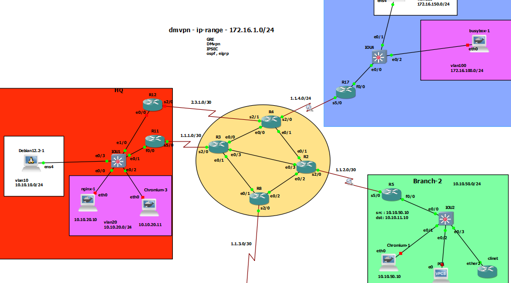

# GRE over IPsec ( IKE version-1 & Crypto Map)

## R11
```
interface Tunnel0
 tunnel source 1.1.1.2
 tunnel destination 1.1.2.2
 ip addr 172.16.1.11 255.255.255.0
 ip mtu 1400
 ip tcp adjust-mss 1360


interface Tunnel1
 tunnel source 1.1.1.2
 tunnel destination 1.1.4.3
 ip addr 172.17.1.11 255.255.255.0
 ip mtu 1400
 ip tcp adjust-mss 1360


crypto isakmp policy 10
 encr aes 256
 hash sha512
 authentication pre-share
 group 14
crypto isakmp key secret address 0.0.0.0 


crypto ipsec transform-set T-SET esp-aes 128 esp-sha-hmac 
 mode transport


ip access-list extended Branch-1-R17
 permit gre host 1.1.1.2 host 1.1.4.3


ip access-list extended Branch-2-R5
 permit gre host 1.1.1.2 host 1.1.2.2


crypto map C-MAP 10 ipsec-isakmp 
 set peer 1.1.4.3
 set transform-set T-SET
 match address Branch-1-R17


crypto map C-MAP 20 ipsec-isakmp 
 set peer 1.1.2.2
 set transform-set T-SET
 match address Branch-2-R5


int serial 5/0
 crypto map  C-MAP


router eig 1
 network 172.16.1.11 0.0.0.0
 network 172.17.1.11 0.0.0.0
 network 10.10.10.1 0.0.0.0
 network 10.10.20.1 0.0.0.0

```


## R17
```
interface Tunnel1
 tunnel source 1.1.4.3
 tunnel destination 1.1.1.2
 ip addr 172.17.1.17 255.255.255.0
 ip mtu 1400
 ip tcp adjust-mss 1360


crypto isakmp policy 10
 encr aes 256
 hash sha512
 authentication pre-share
 group 14
crypto isakmp key secret address 0.0.0.0 


crypto ipsec transform-set T-SET esp-aes 128 esp-sha-hmac 
 mode transport


ip access-list extended HQ-R11
 permit gre host 1.1.4.3 host 1.1.1.2


crypto map C-MAP 10 ipsec-isakmp 
 set peer 1.1.1.2
 set transform-set T-SET
 match address HQ-R11


int serial 5/0
 crypto map  C-MAP


router eig 1
 network 172.17.1.17 0.0.0.0
 network 172.16.100.1 0.0.0.0
 network 172.16.150.1 0.0.0.0

```


## R5
```
interface Tunnel0
 tunnel source 1.1.2.2
 tunnel destination 1.1.1.2
 ip addr 172.16.1.5 255.255.255.0
 ip mtu 1400
 ip tcp adjust-mss 1360


crypto isakmp policy 10
 encr aes 256
 hash sha512
 authentication pre-share
 group 14
crypto isakmp key secret address 0.0.0.0 


crypto ipsec transform-set T-SET esp-aes 128 esp-sha-hmac 
 mode transport


ip access-list extended HQ-R11
 permit gre host 1.1.2.2 host 1.1.1.2


crypto map C-MAP 10 ipsec-isakmp 
 set peer 1.1.1.2
 set transform-set T-SET
 match address HQ-R11


int serial 5/0
 crypto map  C-MAP


router eig 1
 network 172.16.1.5 0.0.0.0
 network 10.10.50.1 0.0.0.0

```