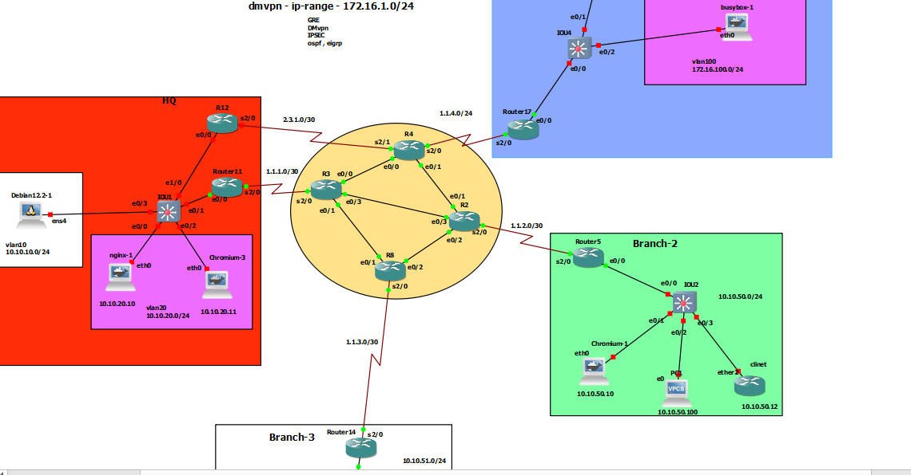

# DMVPN  IPsec ( IKE version-1 & Crypto Map)

## R11
```

int tun 1
ip address 172.16.1.11 255.255.255.0
ip nhrp authentication secret
ip nhrp network-id 1
ip nhrp map multicast dynamic
tunnel source serial 2/0
tunnel mode gre multipoint
ip mtu 1400
ip tcp adjust-mss 1360


! phase 1 
crypto isakmp policy 10
 encr aes 256
 hash sha512
 authentication pre-share
 group 14
crypto isakmp key secret address 0.0.0.0 


! phase 2
crypto ipsec transform-set T-SET esp-aes 128 esp-sha-hmac 
 mode transport


crypto ipsec profile IPSEC-PRO
 set transform-set T-SET
 set pfs group14


crypto ipsec security-association replay window-size 1024


int tun 1
 tunnel protection ipsec profile IPSEC-PRO

 

router eig eig-dmvnp
address-family ipv4 unicast as 2
network 10.10.10.1 0.0.0.0
network 10.10.20.1 0.0.0.0
network 172.16.1.11 0.0.0.0
af-interface tunnel 1
no split-horizon
no next-hop-self

```
## R17
```
int tun 1
ip address 172.16.1.17 255.255.255.0
ip nhrp authentication secret
ip nhrp network-id 1
ip nhrp nhs 172.16.1.11 nbma 1.1.1.2 multicast
tunnel source serial 2/0
tunnel mode gre multipoint
ip nhrp holdtime 600
ip nhrp registration no-unique
ip mtu 1400
ip tcp adjust-mss 1360


crypto isakmp policy 10
 encr aes 256
 hash sha512
 authentication pre-share
 group 14
crypto isakmp key secret address 0.0.0.0 


crypto ipsec transform-set T-SET esp-aes 128 esp-sha-hmac 
 mode transport


crypto ipsec profile IPSEC-PRO
 set transform-set T-SET
 set pfs group14


crypto ipsec security-association replay window-size 1024


int tun 1
 tunnel protection ipsec profile IPSEC-PRO


router eig eig-dmvnp
address-family ipv4 unicast as 2
network 172.16.150.1 0.0.0.0
network 172.16.100.1 0.0.0.0
network 172.16.1.17 0.0.0.0


```


## R5
```
int tun 1
ip address 172.16.1.5 255.255.255.0
ip nhrp authentication secret
ip nhrp network-id 1
ip nhrp nhs 172.16.1.11 nbma 1.1.1.2 multicast
tunnel source serial 2/0
tunnel mode gre multipoint
ip nhrp holdtime 600
ip nhrp registration no-unique
ip mtu 1400
ip tcp adjust-mss 1360


crypto isakmp policy 10
 encr aes 256
 hash sha512
 authentication pre-share
 group 14
crypto isakmp key secret address 0.0.0.0 


crypto ipsec transform-set T-SET esp-aes 128 esp-sha-hmac 
 mode transport


crypto ipsec profile IPSEC-PRO
 set transform-set T-SET
 set pfs group14


crypto ipsec security-association replay window-size 1024


int tun 1
 tunnel protection ipsec profile IPSEC-PRO


router eig eig-dmvnp
address-family ipv4 unicast as 2
network 10.10.50.1 0.0.0.0
network 172.16.1.5 0.0.0.0


```


# R14

```
int tun 1
ip address 172.16.1.14 255.255.255.0
ip nhrp authentication secret
ip nhrp network-id 1
ip nhrp nhs 172.16.1.11 nbma 1.1.1.2 multicast
tunnel source serial 2/0
tunnel mode gre multipoint
ip nhrp holdtime 600
ip nhrp registration no-unique
ip mtu 1400
ip tcp adjust-mss 1360


crypto isakmp policy 10
 encr aes 256
 hash sha512
 authentication pre-share
 group 14
crypto isakmp key secret address 0.0.0.0 


crypto ipsec transform-set T-SET esp-aes 128 esp-sha-hmac 
 mode transport


crypto ipsec profile IPSEC-PRO
 set transform-set T-SET
 set pfs group14


crypto ipsec security-association replay window-size 1024


int tun 1
 tunnel protection ipsec profile IPSEC-PRO


router eig eig-dmvnp
address-family ipv4 unicast as 2
network 10.10.51.1 0.0.0.0
network 172.16.1.14 0.0.0.0


```