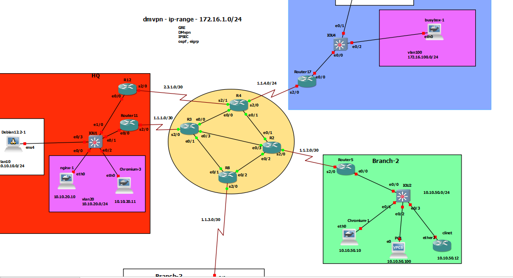

# Tunnel Key



# R11

```

int serial 2/0
no sh
ip addr 1.1.1.2 255.255.255.252


ip route 0.0.0.0 0.0.0.0 1.1.1.1


vrf definition A
 !
 address-family ipv4
 exit-address-family
!
vrf definition B
 !
 address-family ipv4
 exit-address-family
!


interface Tunnel1
 vrf forwarding A
 ip address 192.168.1.11 255.255.255.0
 ip mtu 1400
 ip tcp adjust-mss 1360
 tunnel source 1.1.1.2
 tunnel destination 1.1.4.3
 tunnel key 1


interface Tunnel2
 vrf forwarding B
 ip address 192.168.2.11 255.255.255.0
 ip mtu 1400
 ip tcp adjust-mss 1360
 tunnel source 1.1.1.2
 tunnel destination 1.1.4.3
 tunnel key 2


interface fastEthernet 0/0.10
 encapsulation dot1Q 10
 vrf forwarding A
 ip addr 10.10.10.1 255.255.255.0


interface fastEthernet 0/0.20
 encapsulation dot1Q 20
 vrf forwarding B
 ip addr 10.10.20.1 255.255.255.0


router eigrp my-eigrp-vrf
address-family ipv4 unicast vrf A autonomous-system 2
network 192.168.1.11 0.0.0.0
network 10.10.10.1 0.0.0.0

exit
address-family ipv4 unicast vrf B autonomous-system 2
network 192.168.2.11 0.0.0.0
network 10.10.20.1 0.0.0.0
exit


```


# R17

```


int serial 2/0
no sh
ip addr 1.1.4.3 255.255.255.0


ip route 0.0.0.0 0.0.0.0 1.1.4.1


vrf definition A
 !
 address-family ipv4
 exit-address-family
!
vrf definition B
 !
 address-family ipv4
 exit-address-family
!


interface Tunnel1
 vrf forwarding A
 ip address 192.168.1.17 255.255.255.0
 ip mtu 1400
 ip tcp adjust-mss 1360
 tunnel source 1.1.4.3
 tunnel destination 1.1.1.2
 tunnel key 1


interface Tunnel2
 vrf forwarding B
 ip address 192.168.2.17 255.255.255.0
 ip mtu 1400
 ip tcp adjust-mss 1360
 tunnel source 1.1.4.3
 tunnel destination 1.1.1.2
 tunnel key 2


interface fastEthernet 0/0.100
 encapsulation dot1Q 100
 vrf forwarding B
 ip addr 172.16.100.1 255.255.255.0


interface fastEthernet 0/0.150
 encapsulation dot1Q 150
 vrf forwarding A
 ip addr 172.16.150.1 255.255.255.0


router eigrp my-eigrp-vrf
address-family ipv4 unicast vrf A autonomous-system 2
network 192.168.1.17 0.0.0.0
network 172.16.150.1 0.0.0.0

exit
address-family ipv4 unicast vrf B autonomous-system 2
network 192.168.2.17 0.0.0.0
network 172.16.100.1 0.0.0.0
exit


```