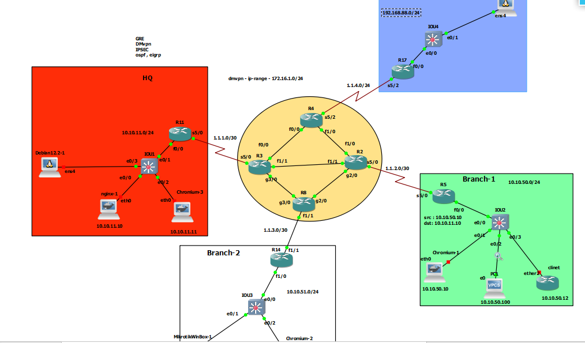

# DMVPN

## R11-HUB

```


int tun 0
ip addr 172.16.1.11 255.255.255.0
ip mtu 1400
ip tcp adjust-mss 1360
ip nhrp network-id 1
ip nhrp authentication AdEs124
tunnel source 1.1.1.2
tunnel mode gre multipoint


ip route 10.10.51.0 255.255.255.0 172.16.1.14
ip route 10.10.50.0 255.255.255.0 172.16.1.5
ip route 192.168.88.0 255.255.255.0 172.16.1.17
```


## R5 - Branch

```
int tun 0
ip addr 172.16.1.5 255.255.255.0
ip mtu 1400
ip tcp adjust-mss 1360
ip nhrp network-id 1
ip nhrp authentication AdEs124
ip nhrp nhs 172.16.1.11
ip nhrp map 172.16.1.11 1.1.1.2
ip nhrp map multicast 1.1.1.2
ip nhrp holdtime 600
ip nhrp registration no-unique
tunnel source 1.1.2.2
tunnel destin 1.1.1.2


ip route 192.168.88.0 255.255.255.0 172.16.1.17
ip route 10.10.51.0 255.255.255.0 172.16.1.14
ip route 10.10.11.0 255.255.255.0 172.16.1.11


```

# R14 - Branch

```
int tun 0
ip addr 172.16.1.14 255.255.255.0
ip mtu 1400
ip tcp adjust-mss 1360
ip nhrp network-id 1
ip nhrp authentication AdEs124
ip nhrp nhs 172.16.1.11
ip nhrp map 172.16.1.11 1.1.1.2
ip nhrp map multicast 1.1.1.2
ip nhrp holdtime 600
ip nhrp registration no-unique
tunnel source 1.1.3.2
tunnel destin 1.1.1.2


ip route 192.168.88.0 255.255.255.0 172.16.1.11
ip route 10.10.50.0 255.255.255.0 172.16.1.11
ip route 10.10.11.0 255.255.255.0 172.16.1.11
```


## R17 - Branch

```
int tun 0
ip addr 172.16.1.17 255.255.255.0
ip mtu 1400
ip tcp adjust-mss 1360
ip nhrp network-id 1
ip nhrp authentication AdEs124
ip nhrp nhs 172.16.1.11
ip nhrp map 172.16.1.11 1.1.1.2
!ip nhrp map multicast 1.1.1.2
ip nhrp holdtime 600
ip nhrp registration no-unique
tunnel source 1.1.4.3
tunnel destin 1.1.1.2


ip route 10.10.51.0 255.255.255.0 172.16.1.14
ip route 10.10.50.0 255.255.255.0 172.16.1.5
ip route 10.10.11.0 255.255.255.0 172.16.1.11


```
