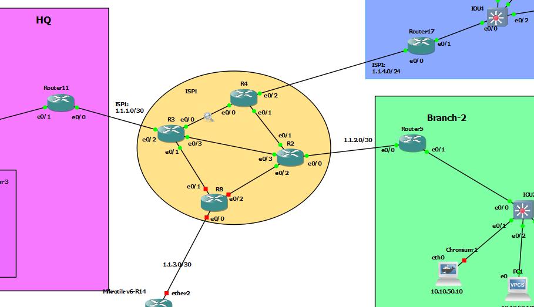

# DMVPN phase - 1 + EIGRRP



## R11-HUB
```


int tun 0
ip addr 172.16.1.11 255.255.255.0
ip mtu 1400
ip tcp adjust-mss 1360
ip nhrp network-id 1
ip nhrp authentication AdEs124
tunnel source 1.1.1.2
tunnel mode gre multipoint
ip nhrp map multicast dynamic


router eig eig-dmvnp
address-family ipv4 unicast as 2
network 10.10.10.1 0.0.0.0
network 10.10.20.1 0.0.0.0
network 172.16.1.11 0.0.0.0
af-interface tunnel 0
no split-horizon


```


## R5 - Branch
```
int tun 0
ip addr 172.16.1.5 255.255.255.0
ip mtu 1400
ip tcp adjust-mss 1360
ip nhrp network-id 1
ip nhrp authentication AdEs124
ip nhrp nhs 172.16.1.11 nbma 1.1.1.2 multicast
ip nhrp holdtime 600
ip nhrp registration no-unique
tunnel source 1.1.2.2
tunnel destin 1.1.1.2


router eig eig-dmvnp
address-family ipv4 unicast as 2
network 10.10.50.1 0.0.0.0
network 172.16.1.5 0.0.0.0


```


## R17 - Branch
```
int tun 0
ip addr 172.16.1.17 255.255.255.0
ip mtu 1400
ip tcp adjust-mss 1360
ip nhrp network-id 1
ip nhrp authentication AdEs124
ip nhrp nhs 172.16.1.11 nbma 1.1.1.2 multicast
ip nhrp holdtime 600
ip nhrp registration no-unique
tunnel source 1.1.4.3
tunnel destin 1.1.1.2


router eig eig-dmvnp
address-family ipv4 unicast as 2
network 172.16.100.1 0.0.0.0
network 172.16.150.1 0.0.0.0
network 172.16.1.17 0.0.0.0


```


# R14 - Branch
```
int tun 0
ip addr 172.16.1.14 255.255.255.0
ip mtu 1400
ip tcp adjust-mss 1360
ip nhrp network-id 1
ip nhrp authentication AdEs124
ip nhrp nhs 172.16.1.11 nbma 1.1.1.2 multicast
ip nhrp holdtime 600
ip nhrp registration no-unique
tunnel source 1.1.3.2
tunnel destin 1.1.1.2


router eig eig-dmvnp
address-family ipv4 unicast as 2
network 10.10.51.1 0.0.0.0
network 172.16.1.14 0.0.0.0


```


