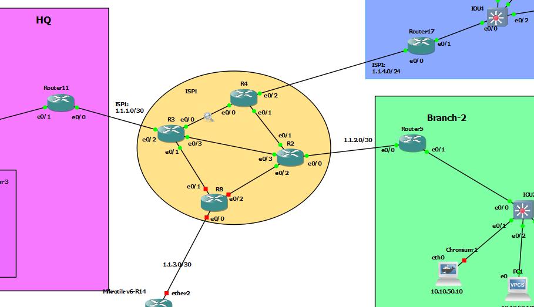

# DMVPN Phase 3 + EIGRP



# R11-HQ

```
int tun 0
 ip address 172.16.1.11 255.255.255.0
 ip nhrp authentication secret
 ip nhrp network-id 1
 ip nhrp map multicast dynamic
 tunnel source eth 0/0
 tunnel mode gre multipoint
 ip mtu 1400
 ip tcp adjust-mss 1360
 ip nhrp redirect


do sh dmvpn


router eig eig-dmvnp
address-family ipv4 unicast as 2
network 10.10.10.1 0.0.0.0
network 10.10.20.1 0.0.0.0
network 172.16.1.11 0.0.0.0
af-interface tunnel 0
no split-horizon

```


# R5-Spoke

```
int tun 0
ip addr 172.16.1.5 255.255.255.0
ip nhrp network-id 1
ip nhrp authentication secret
ip nhrp nhs 172.16.1.11 nbma 1.1.1.2 multicast
tunnel source eth 0/0
tunnel mode gre multipoint
ip nhrp holdtime 600
ip nhrp registration no-unique
ip mtu 1400
ip tcp adjust-mss 1360
ip nhrp shortcut 


do sh dmvpn


router eig eig-dmvnp
address-family ipv4 unicast as 2
network 10.10.50.1 0.0.0.0
network 172.16.1.5 0.0.0.0


```


# R17-Spoke

```
int tun 0
ip addr 172.16.1.17 255.255.255.0
ip nhrp network-id 1
ip nhrp authentication secret
ip nhrp nhs 172.16.1.11 nbma 1.1.1.2 multicast
tunnel source eth 0/0
tunnel mode gre multipoint
ip nhrp holdtime 600
ip nhrp registration no-unique
ip mtu 1400
ip tcp adjust-mss 1360
ip nhrp shortcut 


do sh dmvpn


router eig eig-dmvnp
address-family ipv4 unicast as 2
network 172.16.100.1 0.0.0.0
network 172.16.150.1 0.0.0.0
network 172.16.1.17 0.0.0.0


```
