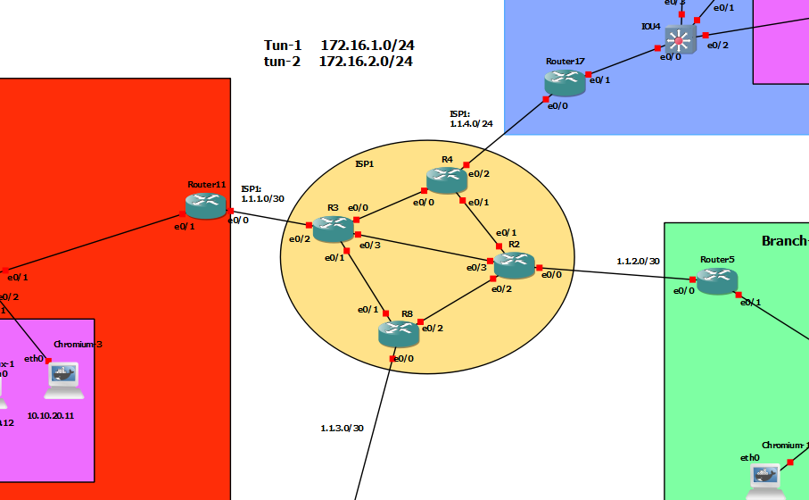

# Site-to-Site-IPsec(IKEv2)



## R11
```

sh cyrpto ikev2 proposal 

crypto ikev2 proposal MYPROPOSAL 
 encryption aes-cbc-128 aes-cbc-192 aes-cbc-256
 group 20 16 14
 integrity sha384 sha256

crypto ikev2 policy MY-POLICY
 proposal MYPROPOSAL


crypto ikev2 keyring MY_KEY
 peer to-R5
  address 1.1.2.2
  pre-shared-key local test11
  pre-shared-key remote test5
  exit
 exit


crypto ikev2 profile IKE-PROF-cisco
 match identity remote address 1.1.2.2
 authentication remote pre-share
 authentication local pre-share 
 keyring local MY_KEY


ip access-list extended IPSEC-ACL-cisco
 10 permit ip 10.10.10.0 0.0.0.255 10.10.50.0 0.0.0.255
! 20 permit ip 10.10.20.0 0.0.0.255 10.10.50.0 0.0.0.255


crypto ipsec transform-set T-SET esp-aes 128 esp-sha-hmac 
 mode tunnel
crypto ipsec security-association lifetime seconds 3600 


crypto map C-MAP 10 ipsec-isakmp 
 set peer 1.1.2.2
 set transform-set T-SET
 match address IPSEC-ACL-cisco
 set ikev2-profile IKE-PROF-cisco
! set pfs group14


int eth 0/0
 crypto map  C-MAP


```


## R5
```


sh cyrpto ikev2 proposal 

crypto ikev2 proposal MYPROPOSAL 
 encryption aes-cbc-128 aes-cbc-192 aes-cbc-256
 group 20 16 14
 integrity sha384 sha256

crypto ikev2 policy MY-POLICY
 proposal MYPROPOSAL


crypto ikev2 keyring MY_KEY
 peer to-R11
  address 1.1.1.2
  pre-shared-key local test5
  pre-shared-key remote test11
  exit
 exit


crypto ikev2 profile IKE-PROF
 match identity remote address 1.1.1.2
 authentication remote pre-share
 authentication local pre-share 
 keyring local MY_KEY


ip access-list extended IPSEC-ACL
 10 permit ip 10.10.50.0 0.0.0.255 10.10.10.0 0.0.0.255
! 20 permit ip 10.10.50.0 0.0.0.255 10.10.20.0 0.0.0.255


! phase 2 tunnel
crypto ipsec transform-set T-SET esp-aes 128 esp-sha-hmac 
 mode tunnel
crypto ipsec security-association lifetime seconds 3600 


crypto map C-MAP 10 ipsec-isakmp 
 set peer 1.1.1.2
 set transform-set T-SET
 match address IPSEC-ACL
 set ikev2-profile IKE-PROF
! set pfs group14


int eth 0/0
 crypto map  C-MAP


```