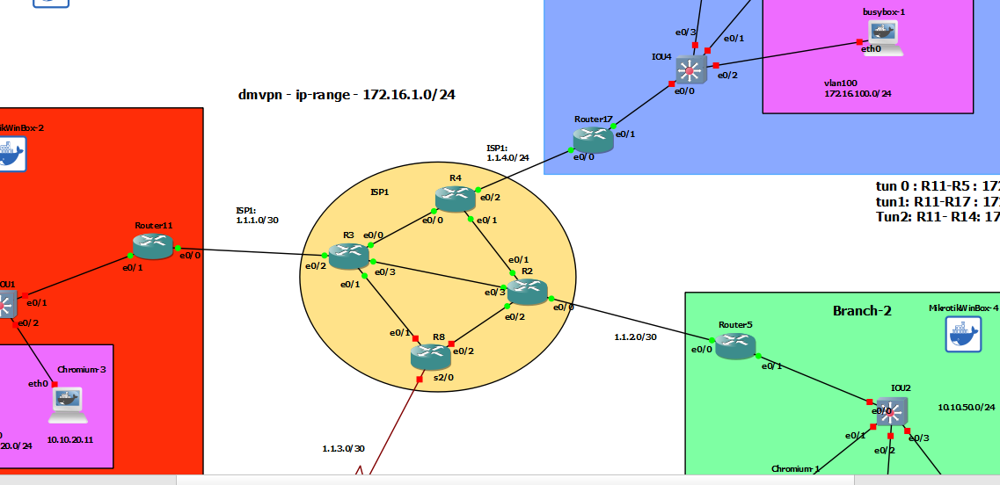

# Multi WAN , FVRF + GRE 




# R11

```

vrf definition ISP1
 !
 address-family ipv4
 exit-address-family
!


interface eth 0/0
 vrf forwarding ISP1
 ip address 1.1.1.2 255.255.255.252
 no sh

      
        

ip route vrf ISP1 0.0.0.0 0.0.0.0 1.1.1.1


interface Tunnel1
 tunnel vrf ISP1
 ip address 172.17.1.11 255.255.255.0
 ip mtu 1400
 ip tcp adjust-mss 1360
 tunnel source 1.1.1.2
 tunnel destination 1.1.4.3
 


interface Tunnel0
 tunnel vrf ISP1
 ip address 172.16.1.11 255.255.255.0
 ip mtu 1400
 ip tcp adjust-mss 1360
 tunnel source 1.1.1.2
 tunnel destination 1.1.2.2
 


router eigrp my-eigrp
address-family ipv4 unicast  autonomous-system 2
network 172.16.1.11 0.0.0.0
network 172.17.1.11 0.0.0.0
network 10.10.10.1 0.0.0.0
network 10.10.20.1 0.0.0.0


! phase-1
crypto ikev2 keyring MY_KEY
 peer ALL
  address 0.0.0.0 0.0.0.0
  pre-shared-key secret

  
crypto ikev2 profile IKE-PROF
 match identity remote address 0.0.0.0
 authentication remote pre-share
 authentication local pre-share
 match fvrf ISP1
 keyring local MY_KEY


crypto ikev2 proposal default
 encryption aes-cbc-256 aes-cbc-192 aes-cbc-128
 integrity sha512 sha384 sha256
 group 24 21 20

! phase-2
crypto ipsec transform-set T-SET esp-aes esp-sha-hmac
 mode transport


crypto ipsec profile IPSEC-PROFILE
 set transform-set T-SET
 set ikev2-profile IKE-PROF
 set pfs group14


crypto ipsec security-association replay window-size 1024


int range tun 0-1
 tunnel protection ipsec profile IPSEC-PROFILE


```

# R17

```

vrf definition ISP1
 !
 address-family ipv4
 exit-address-family
!

interface eth 0/0
 vrf forwarding ISP1
 no sh
 ip address 1.1.4.3 255.255.255.0

        

ip route vrf ISP1 0.0.0.0 0.0.0.0 1.1.4.1


interface Tunnel1
 tunnel vrf ISP1
 ip address 172.17.1.17 255.255.255.0
 ip mtu 1400
 ip tcp adjust-mss 1360
 tunnel source 1.1.4.3
 tunnel destination 1.1.1.2


router eigrp my-eigrp
address-family ipv4 unicast  autonomous-system 2
network 172.17.1.17 0.0.0.0
network 172.16.150.1 0.0.0.0
network 172.16.100.1 0.0.0.0


! phase-1
crypto ikev2 keyring MY_KEY
 peer ALL
  address 0.0.0.0 0.0.0.0
  pre-shared-key secret

  
crypto ikev2 profile IKE-PROF
 match identity remote address 0.0.0.0
 authentication remote pre-share
 authentication local pre-share
 match fvrf ISP1
 keyring local MY_KEY


crypto ikev2 proposal default
 encryption aes-cbc-256 aes-cbc-192 aes-cbc-128
 integrity sha512 sha384 sha256
 group 24 21 20

! phase-2
crypto ipsec transform-set T-SET esp-aes esp-sha-hmac
 mode transport


crypto ipsec profile IPSEC-PROFILE
 set transform-set T-SET
 set ikev2-profile IKE-PROF
 set pfs group14


crypto ipsec security-association replay window-size 1024


int range tun 1
 tunnel protection ipsec profile IPSEC-PROFILE


```


# R5

```

vrf definition ISP1
 !
 address-family ipv4
 exit-address-family
!

interface eth 0/0
 vrf forwarding ISP1
 no sh
 ip address 1.1.2.2 255.255.255.0

        

ip route vrf ISP1 0.0.0.0 0.0.0.0 1.1.2.1


interface Tunnel0
 tunnel vrf ISP1
 ip address 172.16.1.5 255.255.255.0
 ip mtu 1400
 ip tcp adjust-mss 1360
 tunnel source 1.1.2.2
 tunnel destination 1.1.1.2


router eigrp my-eigrp
address-family ipv4 unicast  autonomous-system 2
network 172.16.1.5 0.0.0.0
network 10.10.50.1 0.0.0.0


! phase-1
crypto ikev2 keyring MY_KEY
 peer ALL
  address 0.0.0.0 0.0.0.0
  pre-shared-key secret

  
crypto ikev2 profile IKE-PROF
 match identity remote address 0.0.0.0
 authentication remote pre-share
 authentication local pre-share
 match fvrf ISP1
 keyring local MY_KEY


crypto ikev2 proposal default
 encryption aes-cbc-256 aes-cbc-192 aes-cbc-128
 integrity sha512 sha384 sha256
 group 24 21 20

! phase-2
crypto ipsec transform-set T-SET esp-aes esp-sha-hmac
 mode transport


crypto ipsec profile IPSEC-PROFILE
 set transform-set T-SET
 set ikev2-profile IKE-PROF
 set pfs group14


crypto ipsec security-association replay window-size 1024


int range tun 0
 tunnel protection ipsec profile IPSEC-PROFILE


```
