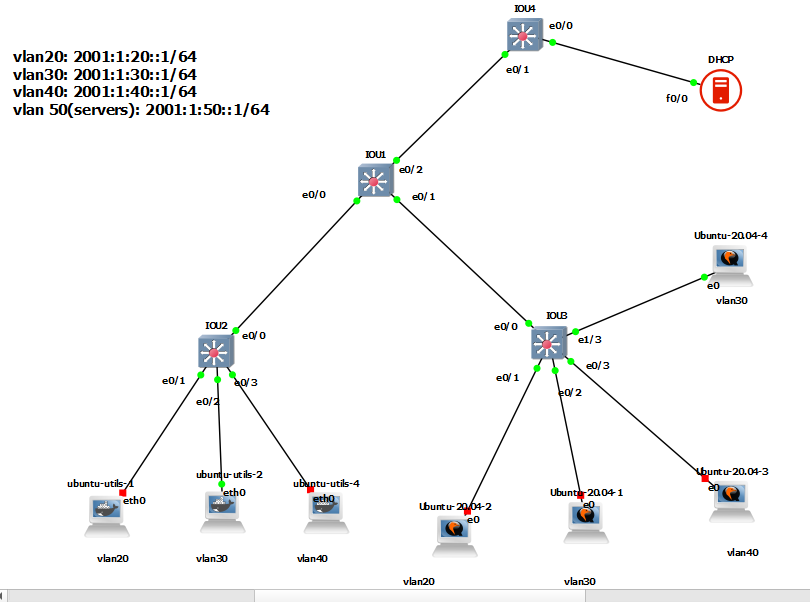

# DHCP
```

ipv6 dhcp pool vlan-20
address prefix 2001:1:20::/64
dns-server 2001:1:20::1
domain-name iman.local


ipv6 dhcp pool vlan-30
address prefix 2001:1:30::/64
dns-server 2001:1:20::1
domain-name iman.local


ipv6 dhcp pool vlan-40
address prefix 2001:1:40::/64
dns-server 2001:1:20::1
domain-name iman.local

interface fast 0/0
ipv6 addr 2001:1:50::2/64
no sh


sh ipv6 dhcp pool
sh ipv6 dhcp binding

ipv6 dhcp server
```


# SW1

```
ipv6 unicast-routing


interface range ethernet 0/0-2
switchport trunk encapsulation dot1q
switchport mode trunk
do sh int trunk


vlan 20,30,40,50

interface vlan 20
ipv6 address 2001:1:20::1/64
no sh
ipv6 nd managed-config-flag
ipv6 nd other-config-flag
ipv6 dhcp relay destination 2001:1:50::2
exit


interface vlan 30
ipv6 address 2001:1:30::1/64
no sh
ipv6 nd managed-config-flag
ipv6 nd other-config-flag
ipv6 dhcp relay destination 2001:1:50::2
exit

interface vlan 40
ipv6 address 2001:1:40::1/64
no sh
ipv6 nd managed-config-flag
ipv6 nd other-config-flag
ipv6 dhcp relay destination 2001:1:50::2
exit


interface vlan 50
ipv6 address 2001:1:50::1/64
no sh
exit


```


# SW2

```

interface ethernet 0/0
switchport trunk encapsulation dot1q
switchport mode trunk

vlan 20,30,40


interface ethernet 0/1
switchport mode access
switchport access vlan 20
exit

interface ethernet 0/2
switchport mode access
switchport access vlan 30
exit

interface ethernet 0/3
switchport mode access
switchport access vlan 40
exit


```


# SW3

```
interface ethernet 0/0
switchport trunk encapsulation dot1q
switchport mode trunk

vlan 20,30,40


interface ethernet 0/1
switchport mode access
switchport access vlan 20
exit

interface ethernet 0/2
switchport mode access
switchport access vlan 30
exit

interface ethernet 0/3
switchport mode access
switchport access vlan 40
exit


interface ethernet 1/3
switchport mode access
switchport access vlan 30
exit

```

# SW4

```
interface ethernet 0/1
switchport trunk encapsulation dot1q
switchport mode trunk

vlan 50

interface ethernet 0/0
switchport mode access
switchport access vlan 50
exit


```


## Client-ubuntu:

```
systemd-resolve --status

sudo apt install network-manage
nmcli dev show | grep 'IP4.DNS'


```