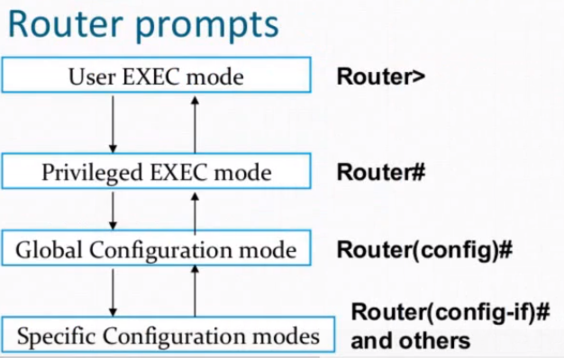

# Network fundamental


### Router Boot Process
* Power on self test
* Load Bootstrap
* Load IOS
* Load Configuration


```
# switch between modes
---> enable ----> en
     disable


---> configure terminal ---> conf t

?  # help


hostname sw1 # change device name
no hostname  # reset hostname


ctrl+shift+6 # for exit 


reload

show  running-config
do show run


# for save config
copy running-config startup-config

show flash:

```