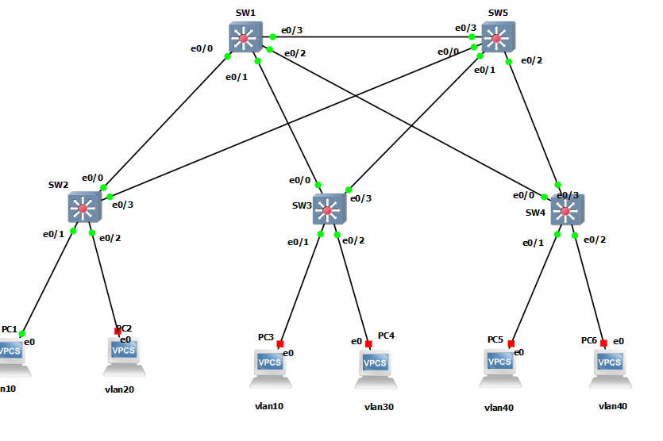

# STP 


```

# SW1

interface range ethernet 0/0-3
switchport trunk encapsulation dot1q
switchport mode trunk
switchport nonegotiate
udld port aggressive

vtp domain test
vtp version 3
vtp mode server
vtp password test hidden
vtp pruning
do sh vtp password

vtp primary
vlan 10,20,30,40


spanning-tree mode rapid-pvst
spanning-tree vlan 1,10,20 priority 0
spanning-tree vlan 30,40 priority 4096


# SW5

interface range ethernet 0/0-3
switchport trunk encapsulation dot1q
switchport mode trunk
switchport nonegotiate
udld port aggressive

vtp domain test
vtp version 3
vtp mode server
vtp password test hidden
vtp pruning
do sh vtp password


spanning-tree mode rapid-pvst
spanning-tree vlan 1,10,20 priority 4096
spanning-tree vlan 30,40 priority 0


# SW2

interface range ethernet 0/0, ethernet 0/3
switchport trunk encapsulation dot1q
switchport mode trunk
switchport nonegotiate
udld port aggressive


vtp domain test
vtp version 3
vtp mode client
vtp password test hidden
do sh vtp password


interface ethernet 0/1
switchport mode access
switchport access vlan 10
switchport nonegotiate
no vtp

spanning-tree portfast
spanning-tree bpduguard enable

interface ethernet 0/2
switchport mode access
switchport access vlan 20
switchport nonegotiate
no vtp
spanning-tree portfast
spanning-tree bpduguard enable


spanning-tree mode rapid-pvst


# SW3

interface range ethernet 0/0, ethernet 0/3
switchport trunk encapsulation dot1q
switchport mode trunk
switchport nonegotiate
udld port aggressive


vtp domain test
vtp version 3
vtp mode client
vtp password test hidden
do sh vtp password


interface ethernet 0/1
switchport mode access
switchport access vlan 10
switchport nonegotiate
no vtp
spanning-tree portfast
spanning-tree bpduguard enable


interface ethernet 0/2
switchport mode access
switchport access vlan 30
switchport nonegotiate
no vtp
spanning-tree portfast
spanning-tree bpduguard enable


spanning-tree mode rapid-pvst


# SW4

interface range ethernet 0/0, ethernet 0/3
switchport trunk encapsulation dot1q
switchport mode trunk
switchport nonegotiate
udld port aggressive


vtp domain test
vtp version 3
vtp mode client
vtp password test hidden
do sh vtp password


interface range ethernet 0/1-2
switchport mode access
switchport access vlan 40
switchport nonegotiate
no vtp

spanning-tree portfast
spanning-tree bpduguard enable


spanning-tree mode rapid-pvst


```