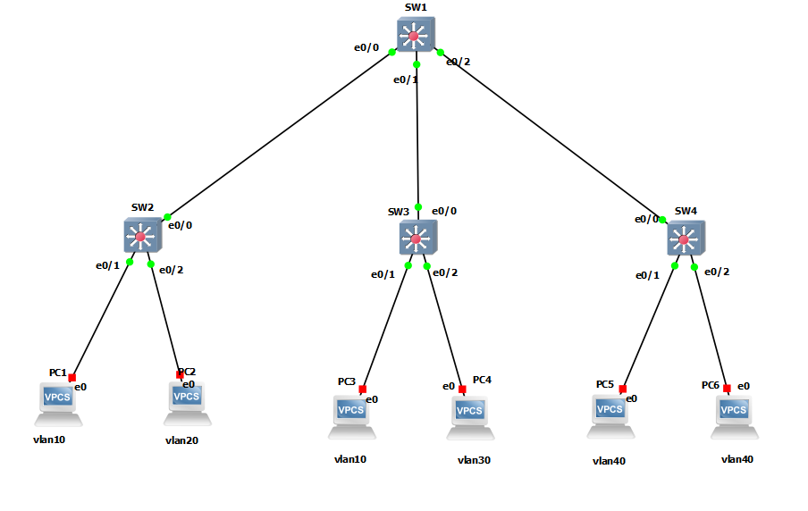

# VTP
VTP (VLAN Trunking Protocol) is a Cisco proprietary protocol that manages the addition, deletion, and renaming of VLANs on a network-wide basis. Its main purpose is to simplify the management of VLANs in a large network environment.


`VLAN Management:` VTP allows network administrators to create, delete, and modify VLANs across multiple switches simultaneously. This helps in ensuring VLAN configuration consistency throughout the network.


`VTP Modes: ` 
There are three VTP modes: Server, Client, and Transparent.

* `Server Mode:` Switches in Server mode can create, modify, and delete VLANs and share this information with other switches in the VTP domain.

* `Client Mode:` Switches in Client mode can’t create, modify, or delete VLANs. They receive VTP updates from switches in Server mode.

* `Transparent Mode:` Switches in Transparent mode don’t participate in VTP updates. They simply forward VTP advertisements.


`VTP Domains:` A VTP domain is a logical group of network devices that share the same VTP configuration. Only devices within the same VTP domain can exchange VTP information.


`VTP Advertisements:` VTP advertisements are sent between switches to communicate VLAN information. These advertisements contain the VLAN IDs, names, and other information necessary for VLAN configuration.


* `Summary Advertisement (SA):` Summary Advertisements are sent by VTP servers to inform other switches in the VTP domain about the current VTP configuration `revision number`. This packet type helps switches determine if they need to update their VLAN configuration.


* `Subset Advertisement (SA):` Subset Advertisements are sent by VTP servers to VTP clients or other servers to provide detailed information about VLANs, including VLAN IDs, names, and other attributes. Subset Advertisements are used to update the VLAN configuration on receiving switches.


* `Advertisement Request (AR):` Advertisement Requests are sent by VTP clients when they want to receive the latest VTP information from VTP servers. This packet type is used by clients to request updates from servers.


* `Join Message (JM): ` it used in vtp pruning, in VTP pruning, switches communicate using Join Messages to inform the network about which VLANs are actively in use on specific trunk links. This helps optimize network bandwidth usage by preventing unnecessary broadcast and multicast traffic for VLANs that are not needed on certain trunk links.


These packet types play a crucial role in VTP communication by ensuring that switches within the same VTP domain have consistent VLAN configurations.


Revision Number: Each VTP advertisement contains a revision number. When a switch receives an advertisement with a higher revision number, it updates its VLAN configuration based on the information in the advertisement.

`It is highly recommended to utilize VTP version 3.
`
# example


```
# SW1

interface range ethernet 0/0-2
switchport trunk encapsulation dot1q
switchport mode trunk
switchport nonegotiate


vtp domain test
vtp version 3
vtp mode server
vtp password test hidden
vtp pruning
do sh vtp password

vtp primary
vlan 10,20,30,40


# SW2
interface ethernet 0/0
switchport trunk encapsulation dot1q
switchport mode trunk
switchport nonegotiate


vtp domain test
vtp version 3
vtp mode client
vtp password test hidden
do sh vtp password


interface ethernet 0/1
switchport mode access
switchport access vlan 10
switchport nonegotiate
no vtp

interface ethernet 0/2
switchport mode access
switchport access vlan 20
switchport nonegotiate
no vtp


# SW3
interface ethernet 0/0
switchport trunk encapsulation dot1q
switchport mode trunk
switchport nonegotiate

vtp domain test
vtp version 3
vtp mode client
vtp password test hidden
do sh vtp password


interface ethernet 0/1
switchport mode access
switchport access vlan 10
switchport nonegotiate
no vtp

interface ethernet 0/2
switchport mode access
switchport access vlan 30
switchport nonegotiate
no vtp


# SW4
interface ethernet 0/0
switchport trunk encapsulation dot1q
switchport mode trunk
switchport nonegotiate

vtp domain test
vtp version 3
vtp mode client
vtp password test hidden
do sh vtp password


interface range ethernet 0/1-2
switchport mode access
switchport access vlan 40
switchport nonegotiate
no vtp


```
