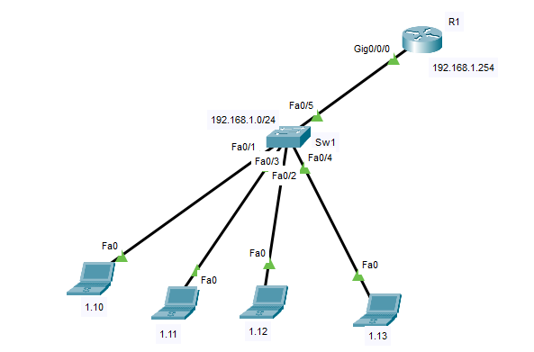

## configurations



```
# R1
hostname R1
int gig 0/0/0 
ip addr 192.168.1.254 255.255.255.0
no sh
exit

ip dhcp pool pool1
network 192.168.1.0 255.255.255.0
dns-server 192.168.1.254
default-router 192.168.1.254
exit
ip dhcp excluded-address 192.168.1.1 192.168.1.9
ip dhcp excluded-address 192.168.1.250 192.168.1.254


username iman privilege 15 secret iman

ip domain-name iman.local
crypto key generate rsa

line vty 0 1
login local
transport input ssh
exit


ip access-list extended 100
permit udp host 0.0.0.0 eq 68 host 255.255.255.255 eq 67

deny udp host 0.0.0.0 eq 68 host 255.255.255.255 eq 67

exit


int gig 0/0/0
ip access-group 100 in
exit
do sh run


```