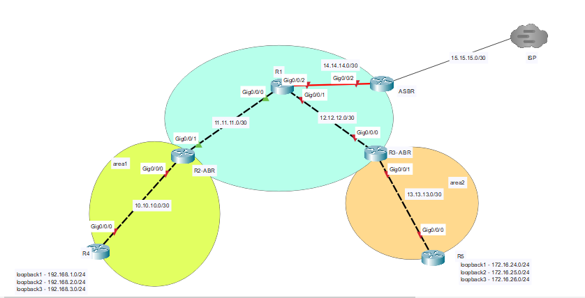

# R1
```
hostname R1
interface gigabitEthernet 0/0/0
ip address 11.11.11.1 255.255.255.252


interface gigabitEthernet 0/0/2
no sh
ip address 14.14.14.1 255.255.255.252


interface gigabitEthernet 0/0/1
ip address 12.12.12.1 255.255.255.252
no sh

interface loopback 1
ip address 1.1.1.1 255.255.255.255

router ospf 1
router-id 1.1.1.1
network 1.1.1.1 0.0.0.0 area 0
exit

interface range gigabitEthernet 0/0/0-2
ip ospf 1 area 0


```


# R2

```

hostname R2


router ospf 1
router-id 2.2.2.2
network 2.2.2.2 0.0.0.0 area 0

interface gigabitEthernet 0/0/1
ip address 11.11.11.2 255.255.255.252
no sh
ip ospf 1 area 0

interface gigabitEthernet 0/0/0
ip address 10.10.10.1 255.255.255.252
no sh
ip ospf 1 area 1


interface loopback 2
ip address 2.2.2.2 255.255.255.255


```


# R3

```

router ospf 1
router-id 3.3.3.3
network 3.3.3.3 0.0.0.0 area 0


hostname R3
interface gigabitEthernet 0/0/0
ip address 12.12.12.2 255.255.255.252
ip ospf 1 area 0
no sh


interface gigabitEthernet 0/0/1
ip address 13.13.13.1 255.255.255.252
ip ospf 1 area 2

interface loopback 3
ip address 3.3.3.3 255.255.255.255


```


# R4

```
hostname R4

router ospf 1
router-id 4.4.4.4
network 4.4.4.4 0.0.0.0 area 1
network 192.168.1.0 0.0.0.255 area 1
network 192.168.2.0 0.0.0.255 area 1
network 192.168.3.0 0.0.0.255 area 1


interface gigabitEthernet 0/0/0
ip address 10.10.10.2 255.255.255.252
ip ospf 1 area 1


int loopback 1
ip addr 192.168.1.1 255.255.255.0

int loopback 2
ip addr 192.168.2.1 255.255.255.0


int loopback 3
ip addr 192.168.3.1 255.255.255.0


int loopback 4
ip addr 4.4.4.4 255.255.255.255


```

# R5

```
hostname R5


router ospf 1
router-id 5.5.5.5
network 5.5.5.5 0.0.0.0 area 2
network 172.16.24.0 0.0.0.255 area 2
network 172.16.25.0 0.0.0.255 area 2
network 172.16.26.0 0.0.0.255 area 2


interface gigabitEthernet 0/0/0
ip address 13.13.13.2 255.255.255.252
ip ospf 1 area 2


int loopback 5
ip address 5.5.5.5 255.255.255.255

```
