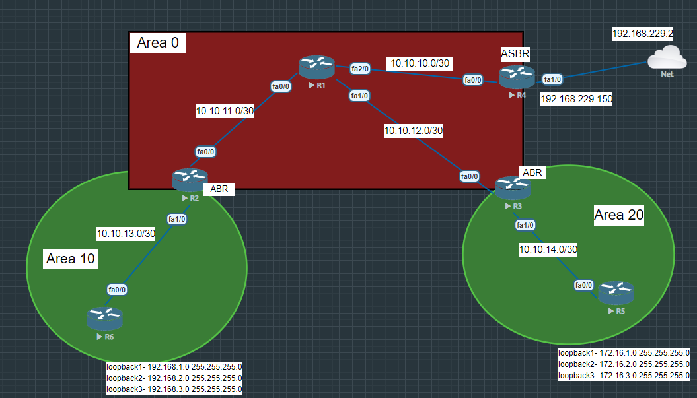

# configuration




# R1

```
hostname R1

int fa 0/0
ip addr 10.10.11.1 255.255.255.252
no sh


int fa 1/0
ip addr 10.10.12.1 255.255.255.252
no sh


int fa 2/0
ip addr 10.10.10.1 255.255.255.252
no sh


router ospf 1
router-id 1.1.1.1
network 10.10.10.0 0.0.0.3 area 0
network 10.10.11.0 0.0.0.3 area 0
network 10.10.12.0 0.0.0.3 area 0


```


# R2-ABR

```
hostname R2

int fa 0/0
ip addr 10.10.11.2 255.255.255.252
no sh

int fa 1/0
ip addr 10.10.13.1 255.255.255.252
no sh


router ospf 1
router-id 2.2.2.2
network 10.10.11.0 0.0.0.3 area 0
network 10.10.13.0 0.0.0.3 area 10
area 10 range 192.168.0.0 255.255.252.0

# route-summerazation
# 192.168.0.0/22
# 255.255.252.0
```


# R3-ABR

```


hostname R3

int fa 0/0
ip addr 10.10.12.2 255.255.255.252
no sh


int fa 1/0
ip addr 10.10.14.1 255.255.255.252
no sh


router ospf 1
router-id 3.3.3.3
network 10.10.12.0 0.0.0.3 area 0
network 10.10.14.0 0.0.0.3 area 20
area 20 range 172.16.0.0 255.255.252.0


```


# R4 - ASBR router

```
hostname R4

interface fastEthernet 1/0
ip address 192.168.229.150 255.255.255.0
exit


interface fastEthernet 0/0
ip address 10.10.10.2 255.255.255.252
exit


ip route 0.0.0.0 0.0.0.0 192.168.229.2
ip name-server 8.8.8.8

router ospf 1
router-id 4.4.4.4
network 10.10.10.0 0.0.0.3 area 0
default-information originate always

```


# R5 

```
hostname R5

int fa 0/0
ip addr 10.10.14.2 255.255.255.252
no sh


int loopback 1 
ip addr 172.16.1.1 255.255.255.0
exit
int loopback 2
ip addr 172.16.2.1 255.255.255.0
exit

int loopback 3
ip addr 172.16.3.1 255.255.255.0
exit


router ospf 1
router-id 5.5.5.5
network 10.10.14.0 0.0.0.3 area 20
network 172.16.0.0 0.0.255.255 area 20
exit


interface range loopback 1-3
ip ospf network point-to-point


```


# R6

```

hostname R6
int fastEthernet 0/0
ip address 10.10.13.2 255.255.255.252


int loopback 1 
ip addr 192.168.1.1 255.255.255.0
exit
int loopback 2
ip addr 192.168.2.1 255.255.255.0
exit

int loopback 3
ip addr 192.168.3.1 255.255.255.0
exit


router ospf 1
router-id 6.6.6.6
network 10.10.13.0 0.0.0.3 area 10
network 192.168.0.0 0.0.255.255 area 10

exit


interface range loopback 1-3
ip ospf network point-to-point


```