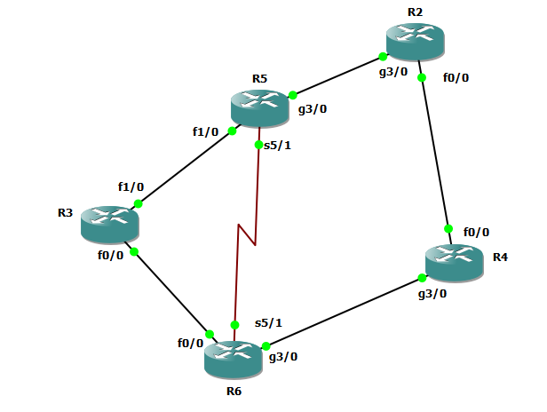

# Example 2
## Nmaed Eigrp




##  R6
```


interface fastEthernet 0/0
ip address 10.10.36.6 255.255.255.0
no sh


interface serial 5/1
ip address 10.10.56.6 255.255.255.0
no sh

int gig 3/0
ip address 10.10.46.6 255.255.255.0
no sh


int loopback 0
ip addr 10.10.6.1 255.255.255.0


router eigrp my-eig-1
address-family ipv4 unicast autonomous-system 8
network 10.10.36.6 0.0.0.0
network 10.10.56.6 0.0.0.0
network 10.10.46.6 0.0.0.0
network 10.10.6.1 0.0.0.0

af-interface fastEthernet 0/0
authentication mode hmac-sha-256 test
hello-interval 10
hold-time 40
exit-af-interface

af-interface gig 3/0
authentication mode hmac-sha-256 test
hello-interval 10
hold-time 40
exit-af-interface


af-interface serial 5/1
authentication mode hmac-sha-256 test
hello-interval 10
hold-time 40
exit-af-interface


```

## R3

```

interface fastEthernet 0/0
ip address 10.10.36.3 255.255.255.0
no sh


interface fastEthernet 1/0
ip address 10.10.35.3 255.255.255.0
no sh


int loopback 0
ip addr 10.10.3.1 255.255.255.0


router eigrp my-eig-1
address-family ipv4 unicast autonomous-system 8
network 10.10.36.3 0.0.0.0
network 10.10.35.3 0.0.0.0
network 10.10.3.1 0.0.0.0

af-interface fastEthernet 0/0
authentication mode hmac-sha-256 test
hello-interval 10
hold-time 40
exit-af-interface

af-interface fa 1/0
authentication mode hmac-sha-256 test
hello-interval 10
hold-time 40
exit-af-interface


```


## R5
```


interface serial 5/1
ip address 10.10.56.5 255.255.255.0
no sh


interface fastEthernet 1/0
ip address 10.10.35.5 255.255.255.0
no sh


int gig 3/0
ip address 10.10.25.5 255.255.255.0
no sh


int loopback 0
ip addr 10.10.5.1 255.255.255.0


router eigrp my-eig-1
address-family ipv4 unicast autonomous-system 8
network 10.10.35.5 0.0.0.0
network 10.10.56.5 0.0.0.0
network 10.10.5.1 0.0.0.0
network 10.10.25.5 0.0.0.0


af-interface gig 3/0
authentication mode hmac-sha-256 test
hello-interval 10
hold-time 40
exit-af-interface

af-interface fa 1/0
authentication mode hmac-sha-256 test
hello-interval 10
hold-time 40
exit-af-interface


af-interface serial 5/1
authentication mode hmac-sha-256 test
hello-interval 10
hold-time 40
exit-af-interface


```


## R2
```


int gig 3/0
ip address 10.10.25.2 255.255.255.0
no sh

interface fastEthernet 0/0
ip address 10.10.24.2 255.255.255.0
no sh


int loopback 0
ip addr 10.10.2.1 255.255.255.0


router eigrp my-eig-1
address-family ipv4 unicast autonomous-system 8
network 10.10.25.2 0.0.0.0
network 10.10.24.2 0.0.0.0
network 10.10.2.1 0.0.0.0

af-interface gig 3/0
authentication mode hmac-sha-256 test
hello-interval 10
hold-time 40
exit-af-interface

af-interface fa 0/0
authentication mode hmac-sha-256 test
hello-interval 10
hold-time 40
exit-af-interface


```


## R4

```


int gig 3/0
ip address 10.10.46.4 255.255.255.0
no sh


interface fastEthernet 0/0
ip address 10.10.24.4 255.255.255.0
no sh


int loopback 0
ip addr 10.10.4.1 255.255.255.0


router eigrp my-eig-1
address-family ipv4 unicast autonomous-system 8
network 10.10.46.4 0.0.0.0
network 10.10.24.4 0.0.0.0
network 10.10.4.1 0.0.0.0

af-interface gig 3/0
authentication mode hmac-sha-256 test
hello-interval 10
hold-time 40
exit-af-interface

af-interface fa 0/0
authentication mode hmac-sha-256 test
hello-interval 10
hold-time 40
exit-af-interface


```